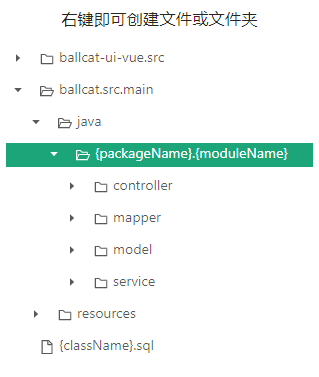
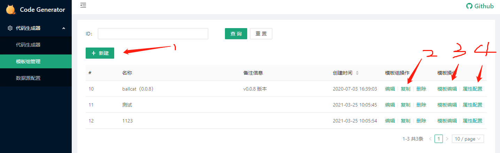
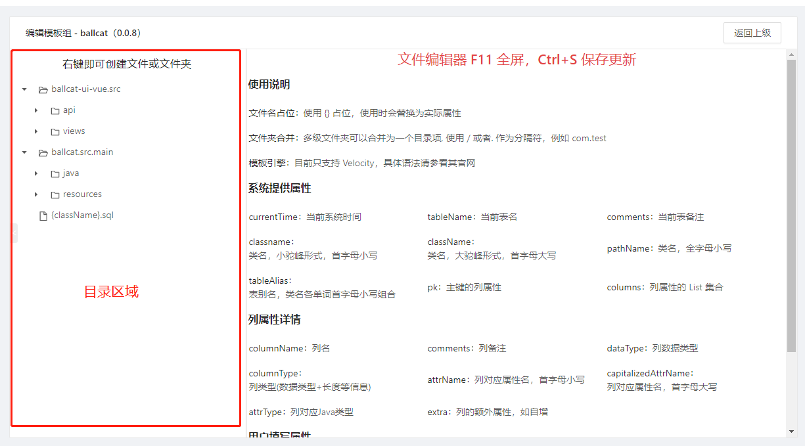
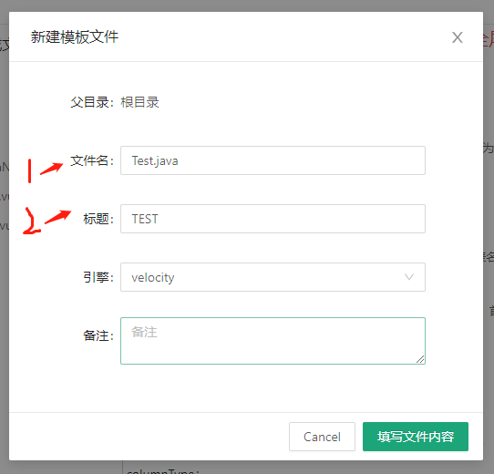
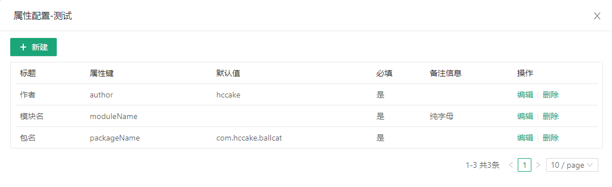
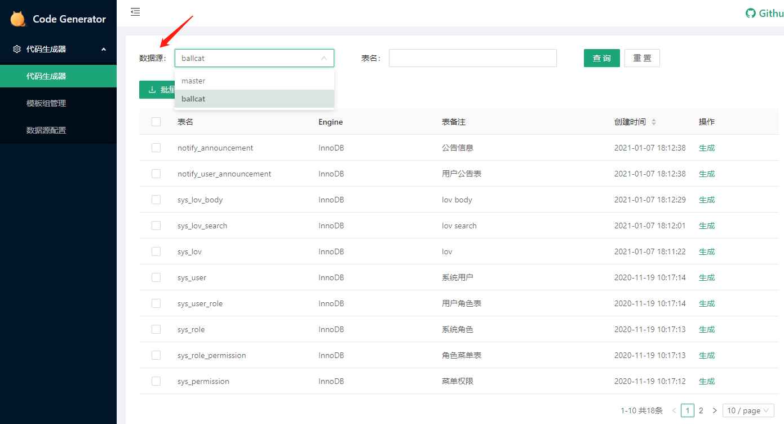

# 代码生成器

## 前言

由于开发时，经常会同时兼顾多个项目，每个项目的代码风格，或者说框架结构不尽相同，导致需要给每个项目都编写其自己的代码生成模板，在经常切换项目开发时，启动关闭不同的代码生成器实在有些许繁琐。

Ballcat Codegen 提供了在线编辑代码生成模板的功能，只需在公司内部服务器中启动一个代码生成器服务，各项目组编写自己的代码模板，在生成代时，选用指定模板即可。


## 主体设计

>  代码生成器中有以下几类主体：数据源（项目）、模板组、模板属性、模板文件

### **数据源（项目）**

一个数据源可以看成是一个项目，在生成不同项目的代码时，切换不同的数据源去获取表信息，支持实时在线的增添数据源，减少代码生成器的使用负担

### **模板组**

一个模板组对应着一种代码生成的规则，每个模板组都有自己的模板文件和模板属性。

ballcat 默认提供了自己的模板组，用户可以自己编写模板组，也可以基于现有的模板组进行复制再微调结构。


### **模板属性**

模板属性挂靠于一个模板组，是系统解析表和字段元数据后获取到的一些信息，也支持用户生成时自定义填写一些属性数据，以下是默认提供的一些属性信息：

**系统属性**

| 属性        | 含义                         | 属性       | 含义                             |
| ----------- | ---------------------------- | ---------- | -------------------------------- |
| tableName   | 当前表名                     | comments   | 当前表备注                       |
| className   | 类名，大驼峰形式，首字母大写 | tableAlias | 表别名，类名各单词首字母小写组合 |
| classname   | 类名，小驼峰形式，首字母小写 | pk         | 主键的列属性                     |
| path        | 类名，全字母小写，多个单词间使用 - 分隔     |  columns    | 列属性的集合       |
| pathName    | 类名，全字母小写             | currentTime | 当前系统时间                 |            |                                  |

**列属性**

| 属性       | 含义                        | 属性                | 含义                     |
| ---------- | --------------------------- | ------------------- | ------------------------ |
| columnName | 列名                        | comments            | 列备注                   |
| dataType   | 列数据类型                  | attrName            | 列对应属性名，首字母小写 |
| attrType   | 列对应Java类型              | capitalizedAttrName | 列对应属性名，首字母大写 |
| columnType | 列类型(数据类型+长度等信息) | extra               | 列的额外属性，如自增     |

**用户自定义属性**

除了以上从表结构中解析出的属性，用户可以自定义一些属性，并在代码生成时进行填写

ballcat 的默认模板使用了三个自定义属性

| 属性       | 含义           | 属性        | 含义 |
| ---------- | -------------- | ----------- | ---- |
| author     | 作者           | packageName | 包名 |
| moduleName | 模块名，纯字母 |             |      |


### **模板文件**

每个模板文件都有其所属的模板组，这些文件分为两类，文件夹以及文件，有上下的层级关系。

一个模板组下的所有文件根据此层级构成一个目录树，这个目录树结构即是代码生成后的文件结构，做到所见即所得。

如下图就是 ballcat 提供的默认模板的目录树结构：



- 文件夹以及文件的路径/名称

  模板文件名支持使用属性占位，使用 `{}` 包含属性名的方式，注意，文件夹名称属性值中的 `.` 将被替换为 `/`

  如上图中选中的文件夹名为 `{packageName}.{moduleName}`，假设生成代码时，`packageName` 属性值为 `com.ballcat.demo`

  而 `{moduleName}` 属性值为 `sys`，则最终该模板文件夹实际将被生成为 4 层结构的文件夹

  ```
  |-- com
    	`-- ballcat
      	`-- demo
      		`-- sys
  ```

  

- 模板文件内容则是使用 `velocity` 模板引擎编写的代码模板，在模板文件中使用属性时，需要使用 `${}` 的形式进行占位。

  例如现在有个属性 `tableName`，值为 `tbl_table`，只需在模板文件中如下编写：

  ```java
  System.out.println("${tableName}");
  ```

  则实际生成后的文件如下所示

  ```java
  System.out.println("tbl_table");
  ```

  更多`velocity`语法参看 [Velocity 官网教程](https://velocity.apache.org/engine/devel/user-guide.html)

  

## 生成过程

1. 根据数据源获取到需要生成表数据信息，解析其结构并转化为模板属性。
2. 根据用户选择的模板组获取到对应的模板文件目录结构，并逐一解析目录项，文件名进行占位替换，文件内容进行模板引擎解析
3. 将文件打包进 zip，进行下载


## 项目结构

```
|-- ballcat-codegen
	|-- ballcat-codegen-backend   ## 代码生成器后端源码
	`-- ballcat-codegen-frontend  ## 代码生成器前端源码
```

项目使用前后端分离开发，但是**启动部署时并不需要关心前端代码**，maven 打包时会自动进行前端代码的构建，并将其打包入后端代码的 resource 文件夹下，只需启动后端即可正常使用代码生成器。


## 快速使用

### 一、 数据库导入

```sql
create database `ballcat_codegen` default character set utf8mb4 collate utf8mb4_general_ci;
```

执行上述命令新建数据库后，执行  ballcat 项目根目录下的 doc 文件夹下 `3ballcat_codegen.sql` 文件中的所有 sql 语句即可。

### 二、 启动应用

在 ballcat 项目根目录执行 `mvn clean install` 完毕后，修改 `ballcat-codegen-backend` 模块下的 `application.yml` 配置文件， 替换数据源的url，用户名以及密码

```yml
spring:
    datasource:
        url: jdbc:mysql://ballcat-mysql:3306/ballcat_codegen?useUnicode=true&characterEncoding=UTF-8&serverTimezone=Asia/Shanghai
        username: root
        password: '123456'  
```

开发环境下，直接启动 `ballcat-codegen-backend` 项目下的 `GeneratorApplication`。

浏览器访问代码生成器项目，默认访问地址 http://localhost:7777


### 三、基础信息配置

#### 3.1 数据源添加

数据源配置 => 新建，填入数据源名称，用户名密码，以及连接地址即可。


> 数据源密码使用 jasypt 加密显示，密钥在配置文件中可以调整


#### 3.2 模板配置



**1： 新建模板组**

点击即可新建一个模板组，建议使用复制已有的模板组来减少操作

**2：复制一个模板组，包括其模板文件和属性配置**

ballcat 默认提供了一个模板组，用户可以复制该模板组后，对生成的代码的路径，名称以及内容做个性化定制


#### **3.3 模板文件编辑**

**模板文件编辑页分为两个部分，左侧是目录区域，右键可以进行创建文件或文件夹，以及重命名等操作。**



**右键点击新建文件后，将弹出一个模态框，需要在模态框中先填写一些基础信息，再继续编写文件内容**



> 文件名: 生成出来的文件的名称

> 标题：此文件的一个备注，主要用于区分类型的，在代码生成时，会提供这些文件的标题，用户可以勾选以便只生成想要的文件


**新建的文件，在标签列上会有一个 灰色的圆点提示，编辑完模板后，记得 `Ctrl + S` 保存。**

双击目录树中的文件，可以新开一个文件标签，修改后也需要进行 `Ctrl + S` 保存才能生效。

选中文件编辑框时按 `F11` 可以进入或退出全屏

#### 3.4 属性配置

自定义一些属性，用于文件名或者文件内容中提取使用，方便自定义一些生成逻辑。

这些属性将在代码生成时，进行填写


### 四、代码生成



#### 4.1 选择项目对应的数据源，获得表信息

#### 4.2 勾选需要生成的表，再点击批量生成，或者直接点击生成按钮进行单表生成

#### 4.3 生成参数配置


1）切换不同的模板组，指定生成的文件

2）这里现实的是该模板组中所有的文件标题，可以进行勾选排除掉不需要生成的文件

3）表前缀，可以为空，有值时，会将表名前缀和填写值进行匹配删除，如表名为 `tbl_table`，表前缀填写值为 `tbl_`，则生成的类名为 `Table`，否则将会是 `TblTable`

4) 模板组中配置的自定义属性，用户在这填写此次生成对应的值，用于模板中的逻辑处理，或占位替换

一切完毕，点击确认后将会生成并下载一个 zip 压缩文件

###  五、代码复制

解压代码压缩包，并复制代码

- 复制对应服务端代码至你本地代码路径
- 复制对应前端代码至你本地代码路径
- 数据库执行权限菜单 Sql
  


## 注意事项

- 权限菜单sql并非直接可以执行，需要注意以下两点：

    **1. 修改变量`目录ID`和`菜单ID`的值。**  

    Ballcat 不推荐使用自增id的方式为权限表, 推荐使用多位字符串进行，菜单、模块、按钮的区分，如 ID`100102`，前两位`10`标识模块序号，中间两位`01`标识该模块下的菜单序号，最后两位`02`标识，该菜单下的权限/按钮序号。 具体ID位数，根据业务情况自拟

    **2. 非Mysql数据源使用问题。**  

    为了简便设置，默认使用的sql生成文件，使用了Mysql的语法，进行了变量设置，如果使用其他数据源，则需去除该部分，只执行基础生成部分的sql，同时也要记得修改sql中所有的变量部分（以@开头）

    

