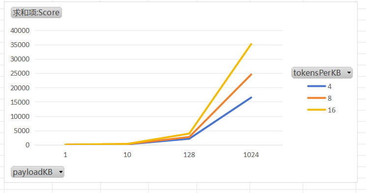

# 日志脱敏

## 适用场景与目标

* 适用场景：在应用日志中存在手机号、身份证号、银行卡号等敏感字段，需要在打印日志时进行自动脱敏，避免泄露隐私或不符合法规要求。

* 能力范围：支持按“前缀关键词 + 分隔符/包裹符 + 值模式”的方式进行高精度、可配置的脱敏，适用于中文/英文、JSON、跨行、多分隔符与长日志等常见场景。

* 与 Logback 的关系：本组件不更换 Appender，通过 Logback ConversionRule（自定义转换词）在输出阶段对消息与异常信息进行脱敏处理。

## 快速开始

### 添加依赖（Maven）

```xml
<!-- 日志脱敏 -->
<dependency>
    <groupId>org.ballcat</groupId>
    <artifactId>ballcat-spring-boot-starter-desensitize</artifactId>
</dependency>
```

### 修改 logback-spring.xml

1. logback-spring.xml：注册转换词并使用

```xml

<!-- 脱敏日志格式 -->
<conversionRule conversionWord="dMsg" converterClass="org.ballcat.desensitize.logging.logback.DesensitizeMessageConverter"/>
<conversionRule conversionWord="dEx"  converterClass="org.ballcatk.desensitize.logging.logback.DesensitizeThrowableProxyConverter"/>
<conversionRule conversionWord="dwEx"  converterClass="org.ballcat.desensitize.logging.logback.DesensitizeExtendedWhitespaceThrowableProxyConverter"/>
```


2. 修改 Pattern 中的转换词

按需替换为上一步注册的 **dMsg**、**dEx**、**dwEx**


### 验证生效

* `logger.info("用户手机号：13877891234")` → 控制台看到 `用户手机号：138****1234`

* 异常输出：`logger.error("oops", new RuntimeException("phone: 13877891234"))` → `RuntimeException: phone: 138****1234`（堆栈保持不变）


## 核心概念

### 前缀门控匹配（Aho-Corasick）

* 通过配置的前缀关键词列表（如 phone、手机号）进行快速命中，只有命中后才尝试识别值，提高性能与精度。

* 大小写不敏感；多个前缀可共存；遇到 `phone` 与 `phoneNumber` 等子串关系时，引擎会按候选规则进行判定，避免“短前缀误吃长前缀”的问题。

### 分隔符（空白跳过、JSON/中文兼容）

* 提供一些基础分隔符，可配置；

* 自动跳过分隔符两侧与内容起始的空白字符；

* 示例：`phone:"13877891234"`、`mobile=【13877891234】`、`手机号：13877891234` 均可识别。

### 窗口化匹配（window-size）

* 为值匹配设置窗口（默认 256），避免对整段日志做正则；

* 既能防止灾难性回溯，也能控制性能开销；可按日志风格与规则特征调整。

### 处理器类型（脱敏策略）

* REGEX\_REPLACEMENT：捕获组替换（例如 `$1****$3`）。

* SLIDE\_MASK：滑动脱敏（左右明文位 + 掩码串），适合数字串（如卡号/手机号），性能好、配置简单。

* SIMPLE\_HANDLE：自定义处理器（实现 `SimpleDesensitizationHandler`），用于特殊格式或复杂逻辑。


## 规则配置指南

### 规则字段说明

* name：规则名称。

* prefixes：前缀关键词列表（大小写不敏感，中文可用）。

* valuePattern：值的正则表达式（建议结合 `matchFromStart=true`）。

* matchFromStart：true → `lookingAt()`；false → `find()`。

* desensitize-type：`regex_replacement` | `slide_mask` | `simple_handle`。

* regex.replacement：REGEX\_REPLACEMENT 的替换模板（支持捕获组）。

* slide.left-plain-text-len / slide.right-plain-text-len / slide.mask-string：滑动脱敏参数。

* simple.handler：自定义处理器类名（实现 `SimpleDesensitizationHandler`）。

更多的脱敏类型配置参看：[脱敏工具文档](./desensitization)

### 完整配置示例

```yaml
ballcat:
  desensitize: 
    logging:
      enabled: true # 开启日志脱敏
      scopes:
        root: false  # 默认日志不脱敏处理
        org.ballcat: true #对 org.ballcat 及其子包下的 logger 进行脱敏处理
    text:
      rules:
        # 手机号，前3后4 
        - name: phone
          prefixes: ["phone", "mobile", "手机号", "phoneNumber"]
          valuePattern: "1[3-9]\\d{9}"
          desensitize-type: slide_mask
          slide:
            left-plain-text-len: 3
            right-plain-text-len: 4
            mask-string: "*"
        # 银行卡，只保留后4 
        - name: bank
          prefixes: ["bank", "bankCard", "银行卡"]
          valuePattern: "\\d{16,19}"
          desensitize-type: slide_mask
          slide:
            left-plain-text-len: 0
            right-plain-text-len: 4
            mask-string: "*"
        # 身份证，前4后3
        - name: idCard
          prefixes: ["idCard", "证件号", "身份证号", "身份证", "idNo"]
          valuePattern: "\\d{17}[\\dXx]"
          desensitize-type: slide_mask
          slide:
            left-plain-text-len: 4
            right-plain-text-len: 3
            mask-string: "*"
```


## Logback 集成

* `DesensitizeMessageConverter`：对格式化后的消息进行脱敏；

* `DesensitizeThrowableProxyConverter`：仅脱敏异常的 message 文本；保留完整堆栈与嵌套异常结构，便于排障；

* `DesensitizeExtendedWhitespaceThrowableProxyConverter`: 同上，只是会在异常上下添加换行处理，适合控制台中使用

注意：必须在 logback-spring.xml 中显式注册转换词（conversionRule）。


## 性能与最佳实践

* 使用前缀门控（配置充足的前缀关键词）以缩小值匹配范围，显著提升性能。

* 对数字串（卡号/手机号）优先使用 SLIDE\_MASK，性能和可读性更好。

* 在能保证从头匹配的前提下使用 `matchFromStart=true`（lookingAt），降低回溯成本。

* 合理设置 `window-size`，针对超长日志与多命中场景进行基准压测。


## 常见问题（FAQ / Troubleshooting）

### 1）“规则生效但没有脱敏”怎么排查？

* 检查是否命中前缀（大小写、中文、词边界）；

* 检查分隔符/包裹符是否在配置集合内；

* 调大 `window-size` 排除窗口过小；

* 若 `matchFromStart=true`，确保正则从值起点即可匹配。

### 2）“被误匹配（如 phone vs phoneNumber）”如何规避？

* 以更具体的前缀进行区分（如 `phoneNumber` 单独配置）；

* 保持合理的前缀词表，避免短前缀覆盖长前缀语义；

* 使用 `matchFromStart=true` 并约束值正则，使短前缀难以误命中。

### 3）为什么异常仅处理 message？

* 目的是保留完整堆栈以利排障；敏感信息通常位于 message 中，因此仅处理 message 部分即可。

### 4）我日志输出没有前缀关键词怎么办

* 为了保证性能，强制需要关键词进行定位，无前缀关键词的全文正则查找极度浪费性能


## 性能测试报告

```bash
Benchmark (payloadKB)  (tokensPerKB)  Mode  Cnt      Score       Error  Units
sanitize            1              4  avgt    5     16.403 ±     1.384  us/op
sanitize            1              8  avgt    5     20.659 ±     2.435  us/op
sanitize            1             16  avgt    5     29.651 ±     4.347  us/op
sanitize           10              4  avgt    5    172.181 ±    20.289  us/op
sanitize           10              8  avgt    5    226.607 ±    54.088  us/op
sanitize           10             16  avgt    5    301.641 ±    24.768  us/op
sanitize          128              4  avgt    5   2102.200 ±   175.687  us/op
sanitize          128              8  avgt    5   2712.330 ±   335.947  us/op
sanitize          128             16  avgt    5   3906.753 ±   318.087  us/op
sanitize         1024              4  avgt    5  16536.230 ±  2490.872  us/op
sanitize         1024              8  avgt    5  24591.522 ±  5936.259  us/op
sanitize         1024             16  avgt    5  35248.802 ± 26604.174  us/op
```

* payloadKB 文本大小

* tokensPerKB 每KB文档插入的敏感词

* Score 平均时长，单位微秒




日志文本长度在 10KB，也就是 1w 字符的时候，日志处理耗时较低，每kb 16 个敏感词处理花费时间大概 300us 左右。
但是日志长度上升到 128KB后，耗时已经达到 ms 级别，对系统的耗时是较大的。
当日志长度上升到 1024KB 后，一条日志的处理需要几十毫秒，并发情况下服务宕机可能性极高。

所以系统中需要尽量控制日志输出长度。

