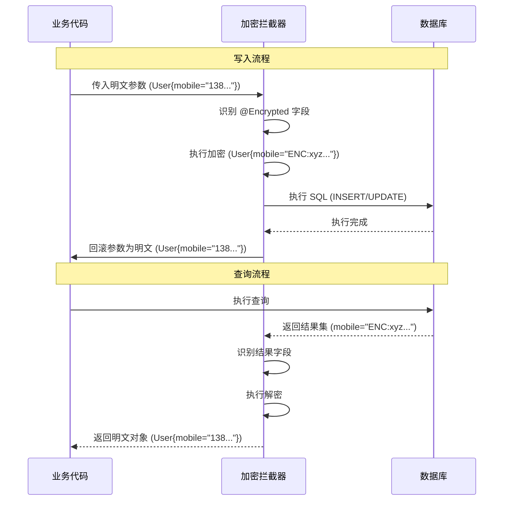

# 字段加解密组件（FieldCrypt）

> since 2.0.0

FieldCrypt 是面向 MyBatis / MyBatis-Plus 的**单字段加解密组件**，通过拦截器 / 织入实现透明加解密，支持等值查询，适合做合规级数据保护。

## 1. 核心特性

- **透明加解密**：写入自动加密、查询自动解密，对业务代码侵入极小。
- **等值查询支持**：默认使用确定性加密，可直接用明文写 `WHERE`、`JOIN`、`GROUP BY` 条件。
- **注解驱动**：通过 `@Encrypted` 精确控制哪些字段/参数需要加密。
- **算法可扩展**：默认 AES-CBC，支持自定义算法（如替换为 AES-GCM 或国密算法）。
- **安全幂等**：密文统一添加 `ENC:` 前缀，防止重复加密，支持明文/密文混合存储以便平滑迁移。

## 2. 适用场景与选型建议

FieldCrypt 是一种**应用层单字段加密方案**。在决定使用之前，建议先根据业务需求（查询能力 vs 安全性）进行方案选型：

| 方案类型 | 核心机制 | 查询能力 | 安全性 |
|---|---|---|---|
| **确定性加密**<br>(FieldCrypt 默认) | 相同明文 -> 相同密文 | ✅ 支持等值 (`=`, `IN`)<br>❌ 不支持范围/模糊 | ⭐ 中<br>存在频率分析风险 |
| **随机化加密** | 相同明文 -> 随机密文 | ❌ 仅支持解密后读取<br>❌ 无法直接 SQL 查询 | ⭐⭐⭐ 高<br>每次密文不同，抗分析 |
| **盲索引 (Blind Index)** | 随机密文 + 哈希索引列 | ✅ 支持等值 (查索引列)<br>❌ 不支持范围/模糊 | ⭐⭐⭐⭐ 高<br>密文随机，仅索引泄露等值信息 |
| **Token 化** | 敏感值替换为无意义 Token | ✅ 支持等值 (查 Token)<br>❌ 不支持范围/模糊 | ⭐⭐⭐⭐⭐ 极高<br>数据库不存敏感数据，仅存映射引用 |
| **保序 / 可搜索加密** | 保留顺序特征 / 分词索引 | ✅ 支持范围 (`>`, `<`) 或<br>✅ 支持模糊 (`LIKE`) | ⭐ 低<br>泄露顺序或文本分布信息 |

**✅ 推荐使用 FieldCrypt 的场景：**
- 业务需要对敏感字段（如手机号、身份证）进行加密存储以满足合规要求。
- **必须保留等值查询能力**（如 `WHERE mobile = ?`），且无法接受引入重量级中间件。
- 接受“确定性加密”带来的安全折衷（即：虽然密文不可逆，但相同数据的密文相同）。

**❌ 不推荐使用的场景：**
- 需要对加密字段进行**模糊查询** (`LIKE`)、**范围查询** (`>`, `<`) 或**排序**。
- 对安全性有极高要求，必须使用随机化加密且同时需要查询（需转向“盲索引”方案）。
- 期望在数据库代理层解决，对应用完全透明（建议使用 ShardingSphere 等中间件）。

---

## 3. 模块说明

- **ballcat-fieldcrypt-core**：核心模块，包含注解、算法接口、元数据解析等
- **ballcat-fieldcrypt-mybatis**：MyBatis 集成，提供参数加密和结果解密拦截器
- **ballcat-fieldcrypt-mybatis-plus**：MyBatis-Plus 集成，支持 Wrapper 条件加密
- **ballcat-spring-boot-starter-fieldcrypt**：Spring Boot Starter，自动装配（推荐使用）

业务接入时通常只需要引入 Starter，对 MyBatis / MP 项目都是无侵入集成。

---

## 4. 快速接入与基本用法

### 4.1 Maven 引入

在业务服务中加入 Starter 依赖：

```xml
<dependency>
  <groupId>org.ballcat</groupId>
  <artifactId>ballcat-spring-boot-starter-fieldcrypt</artifactId>
</dependency>
```

### 4.2 核心注解

首先在实体类以及需要加密的字段上添加相应注解：

```java
@EncryptedEntity // 必须添加！用于快速过滤非加密实体，减少反射开销
public class User {
  // 使用默认算法加密
  @Encrypted
  private String mobile; 

  // 指定算法和参数（需配合自定义算法实现）
  @Encrypted(algo = "AES_GCM", params = "keyId=123")
  private String secretData;
}
```

**`@Encrypted` 属性说明：**
- `algo`: 指定加密算法标识（如 `AES_GCM`），留空则使用全局默认算法。
- `params`: 传递给算法实现的自定义参数（如密钥版本号、盐值等）。
- `mapKeys`: 当字段类型为 `Map` 时，指定需要加密的 Key。

::: tip 性能优化说明
为了提高拦截器性能，组件会**忽略**所有未标注 `@EncryptedEntity` 的类。
因此，请务必在实体类上添加该注解，否则内部字段的 `@Encrypted` 将不会生效。
:::

### 4.3 场景一：使用 MyBatis XML

对于原生 MyBatis XML 方式，**推荐使用实体对象作为参数**，拦截器会自动识别 `@Encrypted` 字段进行加密。

**Mapper 接口：**

```java
@Mapper
public interface UserMapper {
  // 推荐：传入实体对象，自动加密 mobile 字段
  User selectByMobile(@Param("u") User u);
}
```

**XML 配置：**

```xml
<select id="selectByMobile" resultType="...User">
  <!-- 直接使用 #{u.mobile}，拦截器已将其替换为密文 -->
  SELECT * FROM t_user WHERE mobile = #{u.mobile}
</select>
```

### 4.4 场景二：使用 MyBatis-Plus Wrapper

对于 MyBatis-Plus，组件支持在 `Wrapper` 中透明处理加密条件。

```java
// 1. 插入：直接 set 明文，自动加密入库
User u = new User();
u.setMobile("13800138000");
userMapper.insert(u); 

// 2. 查询：读取时自动解密
User dbUser = userMapper.selectById(u.getId());

// 3. Wrapper 查询：构造条件时传入明文
LambdaQueryWrapper<User> qw = Wrappers.lambdaQuery(User.class);
qw.eq(User::getMobile, "13800138000"); // 自动加密匹配
userMapper.selectList(qw);
```

::: warning MyBatis-Plus 使用注意事项
使用 `QueryWrapper` / `UpdateWrapper` 时，**必须传入实体 Class**（如 `Wrappers.lambdaQuery(User.class)`）。
如果不传 Class，MyBatis-Plus 无法获取字段元数据，加密织入逻辑将失效，导致直接使用明文查询而查不到数据。
:::

### 4.5 其他场景（非实体参数）

如果方法参数不是实体对象（如直接传 `String` 或 `Map`），需使用参数级注解：

```java
@Mapper
public interface UserMapper {
  // 单个字符串参数加密
  int deleteByMobile(@Encrypted @Param("mobile") String mobile);

  // Map 参数加密，需指定 key
  int insertByMap(@Encrypted(mapKeys = {"mobile"}) @Param("data") Map<String, Object> data);
}
```

## 5. 配置说明

### 5.1 推荐配置

```yaml
ballcat:
  fieldcrypt:
    enabled: true                 # 全局开关
    aes-key: "your-base64-key..." # 256 位AES密钥
    fail-fast: true               # 加解密失败是否抛出异常
```

::: warning 安全提示
`aes-key` 是数据安全的核心凭证，**严禁以明文形式**出现在代码库或配置文件中。

1. **基础防护**：使用 **Jasypt** 等工具对配置文件中的敏感值进行加密，确保即使配置文件泄露，攻击者也无法直接获取密钥。
2. **进阶防护**：对接 **KMS (Key Management Service)** 或 **Vault**。通过自定义 `CryptoAlgorithm` 实现密钥的动态获取或信封加密，确保明文密钥仅在内存中短暂存在，绝不落盘。
   :::

### 5.2 全量配置项详解

| 配置项 | 类型 | 默认值 | 说明 |
|--------|------|--------|------|
| `ballcat.fieldcrypt.enabled` | Boolean | `true` | 全局开关，控制整个加解密功能是否启用。 |
| `ballcat.fieldcrypt.enable-parameter` | Boolean | `true` | 参数加密拦截器开关。 |
| `ballcat.fieldcrypt.enable-result` | Boolean | `true` | 结果解密拦截器开关。 |
| `ballcat.fieldcrypt.fail-fast` | Boolean | `true` | 加/解密异常是否快速失败；`true` 时抛出异常，`false` 时记录告警并保留原值。 |
| `ballcat.fieldcrypt.restore-plaintext` | Boolean | `true` | SQL 执行后是否将方法参数恢复为明文；建议保持开启，避免业务逻辑读取到密文。 |
| `ballcat.fieldcrypt.default-algo` | String | `AES_CBC_FIXED_IV` | 默认算法 ID；留空/未知时自动回退至 `AES_CBC_FIXED_IV`。切换算法需考虑数据迁移。 |
| `ballcat.fieldcrypt.aes-key` | String | - | AES 密钥（Base64 编码）；默认算法 `AES_CBC_FIXED_IV` 必需。 |

## 6. 运行机制与数据迁移

### 6.1 加解密流程

组件通过 MyBatis 拦截器 + MyBatis-Plus Wrapper 织入，实现透明加解密：



### 6.2 混合存储与平滑迁移

FieldCrypt 采用 **`ENC:` 前缀机制** 来保证幂等性和兼容性：

- **加密时**：检查值是否以 `ENC:` 开头。如果是，视为已加密，跳过；否则进行加密并添加前缀。
- **解密时**：检查值是否以 `ENC:` 开头。如果是，去掉前缀并解密；否则视为明文，原样返回。

**存量数据迁移方案：**
1. **第一阶段（共存期）**：上线 FieldCrypt，新写入数据会自动加密（带 `ENC:`），旧数据仍为明文。读取时组件能自动兼容这两种格式。
2. **第二阶段（清洗期）**：编写脚本批量读取旧数据，重新 update 回去（组件会自动加密），或者直接在数据库层面用 SQL/程序批量刷数。
3. **第三阶段（完成）**：所有敏感字段均为密文。

### 6.3 明文回滚机制

默认开启 `restore-plaintext: true`。
在 MyBatis 执行 SQL 时，拦截器会修改参数对象中的字段为密文。为了防止这个“脏对象”污染后续的业务逻辑（例如 Service 层在插入后又要用到该对象），组件会在 SQL 执行完毕后，自动将参数恢复为之前的明文状态。


## 7. 扩展与自定义

### 7.1 自定义加密算法

实现 `CryptoAlgorithm` 接口并注册为 Bean，即可替换默认算法或新增算法：

```java
@Component
public class AesGcmAlgorithm implements CryptoAlgorithm {
    @Override
    public String algo() { return "AES_GCM"; } // 算法标识

    @Override
    public String encrypt(String plain, CryptoContext ctx) { ... }

    @Override
    public String decrypt(String cipher, CryptoContext ctx) { ... }
}
```

### 7.2 自定义 CryptoEngine

若需定制更复杂的路由策略（如多租户不同密钥、不同前缀策略），可实现 `CryptoEngine` 接口并替换默认 Bean。


## 8. 常见问题 (FAQ)

**Q: 这个方案安全吗？**
A: 默认方案（AES-CBC + 固定 IV）主要用于合规和防拖库，属于“基础防护”。如需更高安全性（如防频率分析），请扩展使用随机 IV 算法（如 AES-GCM），但会失去等值查询能力。

**Q: 已有明文数据如何处理？**
A: 详见“6.2 混合存储与平滑迁移”。组件会将无前缀数据视为明文，支持渐进式迁移。

**Q: 加密后字段长度如何规划？**
A: 密文长度 ≈ `(原长度 * 4/3) + padding + 前缀(4字节)`。建议手机号字段预留 `VARCHAR(64)`。


## 9. 故障排查

### 9.1 MyBatis-Plus 查询不到数据？
- **检查 Wrapper 构造**：确认是否传入了 `Class`，如 `Wrappers.lambdaQuery(User.class)`。
- **检查日志**：开启 DEBUG 日志，确认是否有 `ByteBuddy weaver installed` 提示。

### 9.2 写入后数据库仍是明文？
- **检查注解**：确认实体类上有 `@EncryptedEntity`，字段上有 `@Encrypted`。
- **检查对象复用**：如果在同一个对象上连续做多次操作，可能会因为回滚机制导致后续操作使用明文。

### 9.3 Mapper 返回 String/List 未解密？
- **检查注解**：非实体类返回结果（如 `List<String>`），需要在 Mapper 方法上添加 `@DecryptResult` 注解。
