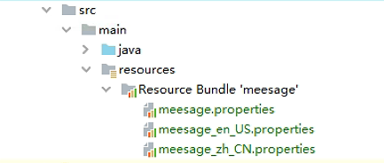

# 国际化(i18n)

**目前文档内容对标 ballcat v0.7.0 以上版本**


## 快速安装

BallCat 基于 Spring 的 `MessageSource` 体系实现了国际化处理

### 依赖引入

springboot 项目，直接在项目中引入 starter 组件：

```xml
<dependency>
  <groupId>com.hccake</groupId>
  <artifactId>ballcat-spring-boot-starter-i18n</artifactId>
  <version>${lastedVersion}</version>
</dependency>
```

非 spring-boot 项目，则在引入以上依赖后自己手动对依赖包中的配置类进行注册处理。

### 业务组件

> 业务组件是非必须组件，用户可以选择不引入

```xml
<dependency>
  <groupId>com.hccake</groupId>
  <artifactId>ballcat-admin-i18n</artifactId>
  <version>${lastedVersion}</version>
</dependency>
```

此依赖引入了 **ballcat-i18n** 业务模块，并自定义了一个 `I18nMessageProvider`

**使用业务组件的前提是，必须要使用 ballat 提供的 i18n 相关的表**

```sql
CREATE TABLE `i18n_data` (
  `id` int(11) NOT NULL AUTO_INCREMENT COMMENT 'ID',
  `language_tag` varchar(10) DEFAULT NULL COMMENT '语言标签',
  `code` varchar(60) DEFAULT NULL COMMENT '唯一标识 = 业务:关键词',
  `message` varchar(255) DEFAULT NULL COMMENT '文本值，可以使用 {} 加角标，作为占位符',
  `remark` varchar(255) DEFAULT NULL COMMENT '备注',
  `create_time` datetime DEFAULT NULL COMMENT '创建时间',
  `update_time` datetime DEFAULT NULL COMMENT '修改时间',
  PRIMARY KEY (`id`),
  UNIQUE KEY `udx_laguage_tag_code` (`language_tag`,`code`)
) ENGINE=InnoDB AUTO_INCREMENT=64 DEFAULT CHARSET=utf8mb4 COMMENT='国际化信息';
```

同时注意添加如下配置：

```yaml
  spring:
    messages:
      basename: "ballcat-*"     
```


## 功能使用

### Resource Bundle

一组各种语言的国际化配置文件组成了一个 Resource Bundle，国际化中从对应语言的国际化配置文件中提取最终的文案。

配置文件名称格式为 `{resourceBundleName}_{language}.properties`, 语言可以为空，作为表示默认的配置。

配置文件的内容为 `key=value` 的结构，key 为 国际化的 Code，value 是该 Code 在当前语言下的文案，支持使用占位符。


我们来定义一个名为 **message** 的 `Resource Bundle`，在 resource 目录下， 新建以下三个文件：

- **messages.properties**  

    ```properties
    # 默认的配置
    test.hello=默认的你好
    test.placeholder={0}，默认你好，{1}
    ```

- **messages_zh_CN.properties **

  ```properties
  # 中文
  test.hello=你好中文
  test.placeholder={0}，你好，{1}
  ```

- **messages_en_US.properties**

  ```properties
  # 英文
  test.hello=Hello
  test.placeholder={0}，hello，{1}
  ```

这时，ide 会自动识别这三个文件，并折叠为名为 **message** 的 **Resource Bundle**




### 属性配置

只新建 **Resource Bundle** 还不行，我们需要将其注册到 Spring 容器中，在 `spring.messages.basename` 属性中配置对应的 **Resource Bundle** 名称即可，**Spring Boot** 会自动进行收集处理

下面是 Spring 提供的完整的关于国际化的配置，可以按需修改：

  ```yaml
  spring:
    messages:
      basename: "messages"               # ResourceBundle 名称，多个用，号隔开，默认是 messages
      fallback-to-system-locale: true     # 当找不到对应区域的语言时，是否回退到系统区域的语言，默认 true
      encoding: 'utf-8'                    # ResourceBundle 的 charset
      cacheDuration: 						# ResourceBundle 加载后的过期时间（s），不设置则不过期，默认不过期
      alwaysUseMessageFormat: false       # 是否始终应用MessageFormat规则，甚至不带参数地解析消息，默认false
      useCodeAsDefaultMessage: false  #找不到对应的区域的语言（包括回退）时，直接返回 code 值，否则抛出异常, 默认flase
  ```


**Ballcat 对 `spring.messages.basename` 做了增强处理，支持通配符 `*`**

例如以下配置，可以读取所有的依赖下以 ”**ballcat-**“ 开头的 ResourceBundle：

```yaml
spring:
  messages:
    basename: "ballcat-*"               # ResourceBundle 名称，多个用，号隔开，默认是 messages
```


### 代码使用

首先注入 `MessageSource` 对象

```java
@Autowired
private MessageSource messageSource;
```

然后使用 `MessageSource#getMessage` 方法，获取对应语言的文案,方法的三个参数分别对应：**国际化的code**、**占位符的参数**、**国际化语言**

#### 最基本的使用

  ```java
  messageSource.getMessage("test.hello", null, Locale.US);  // Hello
  messageSource.getMessage("test.hello", null, Locale.CHINA);  // 你好中文
  ```

#### 带占位符的文案

  ```java
  // 可以看出来，占位符中的{0}，{1}，对应参数数组的角标
  messageSource.getMessage("test.placeholder", new Object[]{"小方", "小红"}, Locale.CHINA);  // 小方，你好，小红
  // 当参数不存在时，会直接输出占位符
  messageSource.getMessage("test.placeholder", new Object[]{"小方"}, Locale.CHINA); // 小方，你好，{1}
  ```

#### 默认值回退

当我们使用不存在的语言时，默认会进行回退到系统的语言

```java
// 没有 UK 的语言，回退到系统语言（测试系统为中文环境）
messageSource.getMessage("test.hello", null, Locale.UK);  // 你好中文
```

可以发现输出的并不是默认配置 **messages.properties** 中的文案，这是因为当开启了语言回退到系统时，就不再使用默认配置了，关闭此配置再进行测试：

```yaml
spring:
  messages:
    fallback-to-system-locale: false #取消回退到系统语言
```

结果则会是：

```java
// 没有 UK 的语言，回退到系统语言（测试系统为中文环境）
messageSource.getMessage("test.hello", null, Locale.UK);  // 默认的你好
```

`MessageSource#getMessage` 的重载方法中还可以指定默认语言，这个优先级最高：

```java
// 没有 UK 的语言，回退到指定的默认语言
messageSource.getMessage("test.hello", null, "指定的你好", Locale.UK);  // 指定的你好
```


### 切换语言

在 Web 环境下，我们需要根据使用者指定的语言进行文案的返回，这时这个语言 Locale 就是动态获取的：

**SpringBoot** 会使用 `LocaleResolver` 解析客户端需要使用的 Locale, 解析完成后会将 Locale 存储于 `LocaleContextHolder` 中，我们可以利用静态方法 `LocaleContextHolder#getLocale` 获取到。

**我们在请求服务端时，必须携带请求头 `Accept-Language`，其值为期望的语言类型**，因为 SpringBoot 默认注册的 `LocaleResolver` 实现类是 `AcceptHeaderLocaleResolver`。

Spring 中一共提供了以下几种语言解析器：

- `AcceptHeaderLocaleResolver`：从 请求头 `Accept-Language` 中解析对应的 Locale
- `CoockieLocaleResolver`：从 Cookie 的属性 `CoockieLocaleResolver.LOCAL` 中解析
- `SessionLocaleResolver`：从 Session 的属性 `SessionLocaleResolver.LOCAL` 中解析
- `FixedLocaleResolver`：固定的语言解析器，总是返回同一个 Locale，默认是 jvm 的语言环境

**用户可以自己按需替换，也可以自定义自己的解析处理器，只需要注册到容器中，就会覆盖默认行为。**


代码中，我们不再写死使用的 Locale，而是改为动态获取，这样在客户端切换语言时，就会动态返回不同的语言文案：

```java
messageSource.getMessage("test.hello", null, LocaleContextHolder.getLocale())
```


### 校验注解的国际化

Hibernate Validator 是自带国际化的，它默认使用名为 **ValidationMessages** 的 `Resource Bundle`，对应的配置文件在其 jar 包。

如果我们需要扩展错误消息，默认情况下，是需要在 classpath 下新建名为 `ValidationMessages.properties` 以及 `ValidationMessages_xx_xx.properties` 类似的语言文件，添加自己的国际化配置。


**Ballcat 对其做了一些扩展，让它可以使用通过 Spring 加载的 `Resource Bundle`** ，同时还可以使用自带的 **ValidationMessages**，另外还提供了一种使用 {} 占位符替代默认的国际化信息的能力。

#### **使用示例**

**我们新建名为 validation 的 Resource Bundle：**

- validation.properties
  
  ```properties
    validation.username=用户名
    validation.age=年龄
    # 可以使用注解中的属性，作为占位符
    validation.range=需要在{min}和{max}之间
  ```
  
- validation_zh_CN.properties
  ```properties
    validation.username=用户名
    validation.age=年龄
    validation.range=需要在{min}和{max}之间
  ```

- validation_en_US.properties

  ```properties
  validation.username=Username
  validation.age=Age
  validation.range=must be between {min} and {max}
  ```


**添加配置：**

  ```yaml
  spring:
    messages:
      basename: "messages, validation"   # ResourceBundle 名称，多个用，号隔开，默认是 messages
  ```


**新建测试实体：**

```java
@Data
public class DemoData {
    // 属性不能为空
    @NotNull
    private String username;

    // 值需要在 0-150 之间
    @Range(min = 0, max = 150)
    private Integer age;
}
```


**测试代码：**

  ```java
  @SpringBootTest
  class I18nTestValidateTests {
      @Autowired
      private Validator validator;
  
      @Test
      void testValidate() {
          // 构造一个 username 为null，age 不满足条件的 实例
          DemoData demoData = new DemoData();
          demoData.setAge(200); 
          // 校验并输出结果
          Set<ConstraintViolation<DemoData>> set = validator.validate(demoData);
          for (ConstraintViolation<DemoData> violation : set) {
              System.out.println(violation.getMessage());
          }
      }
  }
  ```

**输出结果：**

  ```java
  需要在0和150之间
  不能为null
  ```

这个错误信息是 Hibernate Validator 自带的 Resuource Bundle 中提供的，虽然错误信息有了，但是没有说明是哪个属性出现的问题，我们不能直接拿来使用。

#### 自定义错误提示信息

其实校验注解中有个 `message` 属性，可以用来指定错误时的提示信息的。

以 `@NotNull` 为例，它的 `message` 属性的默认值为 `{javax.validation.constraints.NotNull.message}`。

```java
public @interface NotNull {
	String message() default "{javax.validation.constraints.NotNull.message}";
}
```

`{}` 标识一个国际化Code的占位，Hibernate Validator 会自动对其做国际化转换，如果需要原文输出，不加 `{}` 就好了，此外，message 中可以传入多个占位符。

我们修改下注解的 message 属性，拼接上我们的属性名试试：

```java
@Data
public class DemoData {
    // 可以多个占位符传参
    @NotNull(message = "{validation.username}：{javax.validation.constraints.NotNull.message}")
    private String username;

    // 可以使用注解上的值
    @Range(min = 0, max = 150, message = "{validation.age}：{org.hibernate.validator.constraints.Range.message}")
    private Integer age;
}
```

输出结果

```shell
用户名：不能为null
年龄：需要在0和150之间
```

#### 简化 message 配置

以上结果国际化的确是有效的，但是非常繁琐，比如 username 的 notnull 判断，我们写了 username 的国际化配置后，还必须写下其 defaultMessage，这个 defaultMessage 这么长，谁记得住啊？

**所以 Ballcat 对其提供了扩展，支持使用空的花括号表示 defaultMessage 的占位**。

DemoData 校验注解的 message 可以简化为这样：

```java
@Data
public class DemoData {
    // 可以多个占位符传参
    @NotNull(message = "{validation.username}：{}")
    private String username;

    // 可以使用注解上的值
    @Range(min = 0, max = 150，message = "{validation.age}：{}")
    private Integer age;
}
```

输出结果不变：

```shell
用户名：不能为null
年龄：需要在0和150之间
```


### 基于注解的国际化

在上面的章节中，我们举例了使用 `MessageSource` 以编码的方式来进行国际化处理：

```java
messageSource.getMessage("test.hello", null, LocaleContextHolder.getLocale())
```

但是在实际开发中，如果每个需要国际化处理的属性，都要自己手动操作，会很繁琐，所以 Ballcat 提供了注解 `@I18nClass` 和 `@I18nField`，来方便的进行国际化处理。

`@I18nClass` 注解用来添加在有属性需要国际化处理的类上。

`@I18nField` 注解则添加在需要国际化处理属性上，该属性必须是 **String** 类型。

```java
public @interface I18nField {

    // 同 code
	@AliasFor("code")
	String value() default "";

	// 国际化的唯一标识, 当不传值时，则使用被标注的元素的值作为 code
	@AliasFor("value")
	String code() default "";

	/**
	 * 是否进行国际化的条件判断语句（SpEL 表达式），默认为 “”，表示永远翻译
	 * @return 返回 boolean 的 SpEL 表达式
	 */
	String condition() default "";

}
```

> 注意：注解国际化只在 web 环境下生效，在 Response 响应时进行处理

#### 使用示例

```java
@Data
@I18nClass // 只会处理填了此注解的类
public class SysMenuPageVO {

    @Schema(value = "菜单标题，值为国际化code")
    private String title;
    
    // 只会处理填了此注解的属性，且属性必须是 String 类型
    // condition：当对象的属性 type !=2 时才会进行国际化 
	@I18nField(condition = "type != 2")
	@Schema(title = "值为国际化code，但是会进行国际化处理，实际响应出去的是国际化后的菜单名称")
	private String i18nTitle;
    
    @Schema(value = "菜单类型 （0目录，1菜单，2按钮）")
    private Integer type;
	
    // .....省略若干属性
    
}
```

我们将 SysMenuPageVO 对象的中的 `i18nTitle` 属性值设置为对应的国际化Code，在响应时，就会自动进行国际化翻译。

```java
	@GetMapping("/list")
	@Operation(summary = "查询菜单列表", description = "查询菜单列表")
	public R<List<SysMenuPageVO>> getSysMenuPage(SysMenuQO sysMenuQO) {
		List<SysMenu> sysMenus = sysMenuService.listOrderBySort(sysMenuQO);
		if (CollectionUtil.isEmpty(sysMenus)) {
			R.ok(new ArrayList<>());
		}
        // 这一步转换处理，顺便给 i18nTitle 赋值
		List<SysMenuPageVO> voList = sysMenus.stream().map(SysMenuConverter.INSTANCE::poToPageVo)
				.collect(Collectors.toList());
		return R.ok(voList);
	}
```

响应数据

```json
{
    "code": 200,
    "message": "Success",
    "data": [
        {
            "id": 100100,
            "title": "menu.system.user",
            "i18nTitle": "系统用户", // 翻译结果
            "type": 1
        },
        {
            "id": 100800,
            "title": "menu.system.menu",
            "i18nTitle": "菜单权限", // 翻译结果
            "type": 1
        }
    ]
}
```


### 动态的国际化配置 

#### 使用介绍
实际开发中我们经常还会有业务需求上的国际化，例如：
- 国家表，可能需要在不同语言环境下展示不同语言的国家名。
- 后台管理中的菜单，数据是存储在数据库中，我们也需要根据不同环境展示不同的语言的菜单名。

使用 Resource Bundle 中硬编码中的国际化，不利于动态的增加和修改国际化配置，BallCat 为此抽象了一个 `DynamicMessageSource`，其内部利用一个 `I18nMessageProvider` 对象来动态获取国际化配置信息。

```java
/**
 * 国际化信息的提供者，使用者实现此接口，用于从数据库或者缓存中读取数据
 * @author hccake
 */
public interface I18nMessageProvider {

	/**
	 * 获取 I18nMessage 对象
	 * @param code 国际化唯一标识
	 * @param locale 语言
	 * @return 国际化消息
	 */
	I18nMessage getI18nMessage(String code, Locale locale);

}
```


用户只需注册自己的 `I18nMessageProvider` 实现类到 spring 容器中即可。

也可以参看快速安装一节：直接引入 **ballcat-admin-i18n** 业务组件，其中已经默认提供了一个 `CustomI18nMessageProvider` 实现类, 会利用数据库 + 缓存来读取国际化信息。

> 注意，业务组件会依赖 mybatis-plus 和 ballcat-spring-boot-starter-redis 组件，如果无法使用这两个组件，请参考其实现方式，自行构建和管理 I18nMessageProvider


#### 关键依赖  

如下 yaml 配置，可以读取所有的依赖下以 ”**ballcat-**“ 开头的 ResourceBundle：
```yaml
  spring:
    messages:
      basename: "ballcat-*"     
```

> 如果使用 ballcat 的 i18n 业务模块，请务必配置以上的 basename，否则国际化处理时可能会因为找不到对应的配置而抛出异常。
> 当然，你可以在自己项目中配置对应国际化信息的 key value，这样也能解决 

由于 starter 包是不应该介入业务的，所以没有提供默认的 `I18nMessageProvider` 实现，该 bean 必须由使用者自己注册。
其对应动态配置文件的存储可以是任何方式，如存在 mysql、redis、mongo、es、内存中等等。

**ballcat-admin-i18n**

```xml
    <dependency>
        <groupId>com.hccake</groupId>
        <artifactId>ballcat-admin-i18n</artifactId>
        <version>${lastedVersion}</version>
    </dependency>
```

当然，ballcat-i18n 相关的业务模块中，也提供了一种基于 mysql 存储的
`I18nMessageProvider`，同时添加了本地 和 redis 双重缓存，减少频繁读取国际化信息的查询开销。

所以如果不需要定制自己的 `I18nMessageProvider`，则可以直接引入 **ballcat-admin-i18n**，并在数据库中生成下表，即可完成国际化：


### Excel导出的国际化

参看 Excel 导入导出的文档：http://www.ballcat.cn/guide/feature/excel.html


## 前端国际化

前端的国际化基于 vue-i18n，官网地址：https://kazupon.github.io/vue-i18n/zh/


### 国际化的关键文件

-  `src/config/projectConfig.js`

该文件中定义了系统的默认语言

-  `src/locales/index.js`

该文件中对 vue-i18n 进行了引入和实例构造，并对语言配置文件实行了懒加载处理，避免无用的网络开销。

> 这里默认是不支持回退语言的，否则必须先加载回退语言

-  `src/core/bootstrap.js`

该文件中定义了一个方法，该方法被设置为 vue 的 created 钩子函数，所以在进入或者刷新页面时必然会执行此方法，

我们在此方法中调用了 `src/locales/index.js` 中提供的方法，进行国际化环境的初始化。

- `src/util/request.js`

  axios 配置文件，在 request interceptor 中，对所有请求添加了 Accept-Language 的 header 头


### 国际化配置的存储

-  `src/store/modules/i18n.js`

  ```js
  const i18n = {
  state: {
    lang: defaultLanguage
  },
  mutations: {
    SET_LANG: (state, lang) => {
      state.lang = lang
    }
  },
  getters: {
    lang: state => state.lang
  }
  }
  ```

vuex 模块，抛出了 getters：lang，用于组件获取当前语言，动态更新

-  `src/store/storage-types.js`

  ```js
  export const APP_LANGUAGE = 'app_language'
  ```

定义了 localeStorage 中的存储 key ，方便用户选择语言后的持久化，毕竟 vuex 是存储于内存，持久化才可以防止每次刷新页面都变回默认语言


### 国际化的使用

#### 基本使用

$t() 方法中传入国际化的 code 即可，$t 已被挂在到 vue 原型中：

```vue
<a-form-item :label="$t('i18n.i18nData.code')">
<a-input v-model="queryParam.code" :placeholder="$t('message.pleaseEnter')" />
</a-form-item>

<a-button type="primary" @click="reloadTable">{{ $t('action.query') }}</a-button>
```

更多使用方法，参看 vue-i18n 文档。


#### 字典

Ballcat 提供的字典组件中，字典数据是存储在服务端的，所以国家化配置实际也是需要在服务端配置，字典项的 attributes 的属性下，有个 languages 对象，该对象的属性 key 为 language-tag，value 即为对应的文本值。

默认已经做好了，国际化的自适应，所以对于字典的国际化，开发者只需在字典项的设置中配置好即可，无需过多关心。


#### 表格

表格列的国际化也很简单，将原本写在 data 下的表格列配置，移入 computed 下，变为计算属性，即可跟随语言环境切换。

```js
computed: {
  columns () {
    return [
      {
        title: '#',
        dataIndex: 'id'
      },
      {
        title: this.$t('i18n.i18nData.languageTag.text'),
        dataIndex: 'languageTag'
      },
      {
        title: this.$t('i18n.i18nData.code.text'),
        dataIndex: 'code'
      },
      {
        title: this.$t('i18n.i18nData.message.text'),
        dataIndex: 'message'
      },
      {
        title: this.$t('common.remark'),
        dataIndex: 'remark'
      }
    ]
  }
}
```


#### 路由（菜单、多页签、面包屑）

由于路由信息是从服务端返回的，所以当语言切换时，会自动重新向服务端拉取对应语言的路由信息，并重置路由。

重置路由后会发出一个  ”switch-language“ 的事件，在 MultiTab.vue 多页签组件中，监听到此事件，就会进行 title 的切换。


LangSelect 下的 switchLang 方法：

```js
switchLang (row) {
  const newLang = row.key
  if (this.lang !== newLang) {
    // 切换国际化配置
    switchLanguage(newLang)
    // 切换菜单/路由的国际化
    this.GenerateRoutes().then(() => {
      // 重置路由
      resetRouter()
      router.addRoutes(this.userRouters)
      // 发送切换语言事件，多页签会接收此事件，进行多语言切换
      this.$bus.$emit('switch-language', newLang)
    })
  }
}
```

