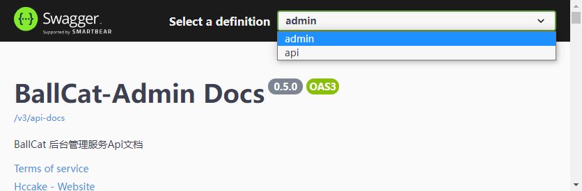

# OpenAPI 文档 (Swagger)


## 什么是 OpenAPI

首先 OpenAPI 其实就是 Swagger,  Swagger 规范于 2015 年 更名为 OpenAPI 规范，简称 OAS.

OpenAPI 规范的变更时间:

| 版本      | 日期           | 笔记                                         |
| --------- | -------------- | -------------------------------------------- |
| 3.0.3     | 2020-02-20     | OpenAPI 规范 3.0.3 补丁发布                  |
| 3.0.2     | 2018-10-08     | OpenAPI 规范 3.0.2 补丁发布                  |
| 3.0.1     | 2017-12-06     | OpenAPI 规范 3.0.1 补丁发布                  |
| **3.0.0** | **2017-07-26** | **OpenAPI 规范 3.0.0 的发布**                |
| 3.0.0-rc2 | 2017-06-16     | 3.0 规范的 rc2                               |
| 3.0.0-rc1 | 2017-04-27     | 3.0 规范的 rc1                               |
| 3.0.0-rc0 | 2017-02-28     | 3.0 规范的实施者草案                         |
| **2.0**   | **2015-12-31** | **将 Swagger 2.0 捐赠给 OpenAPI Initiative** |
| 2.0       | 2014-09-08     | Swagger 2.0 发布                             |
| 1.2       | 2014-03-14     | 正式文件的初始发布。                         |
| 1.1       | 2012-08-22     | Swagger 1.1 发布                             |
| 1.0       | 2011-08-10     | Swagger 规范的首次发布                       |

可以看到，3.0.0 发布距今 2021 年，已有 4 年之久了，是时候抛弃 Swagger2 切换到 OpenApi3 了。


升级 Swagger2 到 OpenApi3，可以参看此 [文档](/guide/other/swagger2ToOpenApi3.html)


## 使用方式

> 由于 springfox 社区已经超过一年半的时间没有进行更新维护了，所以推荐大家使用 springdoc-openapi 来构建 swagger 文档。

springdoc 官方文档地址：https://springdoc.org，这里摘录并翻译部分，更多使用可参看原文档。


### 依赖引入

引入 springdoc-openapi-ui，在 springboot 环境下，直接启动即可，无需任何额外配置

```xml
   <dependency>
  <groupId>org.springdoc</groupId>
  <artifactId>springdoc-openapi-ui</artifactId>
  <version>${lastedVersion}</version>
</dependency>
```

这将自动将 swagger-ui 部署到 spring-boot 应用程序：

- 文档将以 HTML 格式提供，使用官方 [swagger-ui jars](https://github.com/swagger-api/swagger-ui.git)
- 启动项目后，访问 `http://server:port/context-path/swagger-ui.html` 即可进入 Swagger UI 页面，OpenAPI 描述将在以下 json 格式的 url 中 提供：`http://server:port/context-path/v3/api-docs`
  - server：域名 或 IP
  - port：服务器端口
  - context-path：应用程序的上下文路径，springboot 默认为空
- 文档也可以 yaml 格式提供，位于以下路径：/v3/api-docs.yaml


### 替换 UI

如果嫌弃官方提供的 swagger-ui 不美观，或者使用不顺手，可以选择只引入对于 swagger 注解处理依赖

- spring-webmvc 环境下引入

    ```xml
       <dependency>
          <groupId>org.springdoc</groupId>
          <artifactId>springdoc-openapi-webmvc-core</artifactId>
          <version>${lastedVersion}</version> 
       </dependency>
    ```

- spring-webflux 环境下引入

  ```xml
     <dependency>
        <groupId>org.springdoc</groupId>
        <artifactId>springdoc-openapi-webflux-ui</artifactId>
        <version>${lastedVersion}</version> 
     </dependency>
  ```


json 格式的文档将在以下 url 处提供： `http://server:port/context-path/v3/api-docs`，然后通过引入其他的 swagger ui，访问此地址进行 API 展示。

国产的 **Knife4j (原 swagger-bootstrap-ui)**  就提供了对于 springdoc-openapi 的支持，只需引入

```xml
		<!-- swagger 增强版 ui -->
		<dependency>
			<groupId>com.github.xiaoymin</groupId>
			<artifactId>knife4j-springdoc-ui</artifactId>
			<version>3.0.3</version>
		</dependency>
```

> 注意，这里一定要引入 v3.0.3 或以上版本，目前最高 v3.0.3


**Knife4j** 的 UI 访问地址有所不同，页面映射在 `doc.html` 路径下，启动项目后，访问 `http://server:port/context-path/doc.html`

即可进入 Knife4j 的 Swagger UI 页面。


### Javadoc 支持

springdoc-openapi 目前支持将 javadoc 转换为 swagger 信息来源的能力，而无需用户在项目中添加对应的 Swagger 的注解。

对于想要启用 javadoc 支持的项目，在之前的依赖之外，还需要额外添加以下依赖：

```xml
   <dependency>
      <groupId>org.springdoc</groupId>
      <artifactId>springdoc-openapi-javadoc</artifactId>
      <version>${lastedVersion}</version> 
   </dependency>
```

此依赖项改进了对 javadoc 标记和注释的支持：

- 方法的 javadoc 注释：解析为 `@Operation` 描述
- `@return `:  解析为 `@Operation` 响应描述
- 属性的 javadoc 注释：被解析为此字段的 `@Schema` 描述。

> javadoc 支持基于 [therapi-runtime-javadoc](https://github.com/dnault/therapi-runtime-javadoc)，所以需要开启了对应的注解处理器，否则不会生效

在 `maven-compiler-plugin` 添加对应的注解处理器

```xml
    <build>
        <plugins>
            <plugin>
                <groupId>org.apache.maven.plugins</groupId>
                <artifactId>maven-compiler-plugin</artifactId>
                <configuration>
                    <annotationProcessorPaths>
                        <path>
                            <groupId>com.github.therapi</groupId>
                            <artifactId>therapi-runtime-javadoc-scribe</artifactId>
                            <version>0.12.0</version>
                        </path>
                    </annotationProcessorPaths>
                </configuration>
            </plugin>
        </plugins>
    </build>
```

> 如果同时存在 swagger-annotation 描述和 javadoc 注释。将使用 swagger-annotation 描述的值。


### 定制 OpenApi 基本信息

springdoc 默认只支持使用使用注解，或者注册 SpringBean 的形式构建 openApi，由于之前习惯了在 yaml 中定义这些信息，所以 ballcat 对此进行了部分封装，同时支持 cors 跨域配置，方便做文档聚合。

依赖引入：

```xml
    <dependency>
        <groupId>com.hccake</groupId>
        <artifactId>ballcat-extend-openapi</artifactId>
        <version>${lastedVersion}</version>
    </dependency>
```

配置示例：

```yaml
ballcat:
  openapi:
    title: BallCat-Admin Docs 
    description: BallCat 后台管理服务Api文档
    version: ${project.version}
    terms-of-service: http://www.ballcat.cn/
    license:
      name: Powered By BallCat
      url: http://www.ballcat.cn/
    contact:
      name: Hccake
      email: chengbohua@foxmail.com
      url: https://github.com/Hccake
    # 鉴权方式配置
    security-schemes:
      apiKey:
        type: APIKEY
        in: HEADER
        name: 'api-key'
      oauth2:
        type: OAUTH2
        flows:
          password:
            token-url: http://ballcat-admin:8089/oauth/token
    # 全局默认的鉴权方式支持
    global-security-requirements:
      oauth2: []
      apiKey: []
```


## 属性配置

### ballcat-extend-openapi 属性

| 参数名称                                                     | 默认值        | 描述                                                         |
| :----------------------------------------------------------- | :------------ | :----------------------------------------------------------- |
| ballcat.openapi.enabled                                      | `true`        | `Boolean`,  用于开启或关闭 OpenApi 文档                      |
| ballcat.openapi.title                                        |               | `String`. OpenApi 标题                                       |
| ballcat.openapi.terms-of-service                             |               | `String`. OpenApi 描述                                       |
| ballcat.openapi.version                                      |               | `String`. OpenApi 服务条款URL                                |
| ballcat.openapi.contact.name                                 |               | `String`. OpenApi 联系人名称                                 |
| ballcat.openapi.contact.url                                  |               | `String`. OpenApi 联系 URL 地址                              |
| ballcat.openapi.contact.email                                |               | `String`. OpenApi 联系邮箱                                   |
| ballcat.openapi.license.name                                 |               | `String`. 许可证名称                                         |
| ballcat.openapi.license.url                                  |               | `String`. 许可证 url                                         |
| ballcat.openapi.external-docs.description                    |               | `String`. 扩展文档描述                                       |
| ballcat.openapi.external-docs.url                            |               | `String`. 扩展文档链接                                       |
| ballcat.openapi.external-docs.security-schemes.*             |               | `Map`. 安全配置的map，key 为 String 类型，value 为 SecurityScheme 类型，其属性太多，这里不展开了，具体可参看 open api 官方文档 [securitySchemeObject](https://github.com/OAI/OpenAPI-Specification/blob/3.0.1/versions/3.0.1.md#securitySchemeObject) |
| ballcat.openapi.external-docs.global-security-requirements.* |               | `Map`. 全局默认的安全配置，key 对应刚才配置的 SecurityScheme , value 为 list 类型，用来存放安全配置需要的 scope，除了 `oauth2` 和 `openIdConnect` 类型的安全配置，其余都是空数组，参看[官方文档](https://github.com/OAI/OpenAPI-Specification/blob/3.0.1/versions/3.0.1.md#security-requirement-object) |
| ballcat.openapi.cors-config.enabled                          | `false`       | `Boolean`,  用于开启或关闭 CORS 跨域配置，默认不开启         |
| ballcat.openapi.cors-config.url-pattern                      | `/**`         | `String`.  跨域对应的 url 匹配规则，为了方便调试，默认为全局 |
| ballcat.openapi.cors-config.allowed-origins                  |               | `List of Strings`.允许跨域的源                               |
| ballcat.openapi.cors-config.allowed-origin-patterns          |               | `List of Strings`.允许跨域来源的匹配规则                     |
| ballcat.openapi.cors-config.allowed-methods                  | `["*"]`       | `List of Strings`.允许跨域的方法列表                         |
| ballcat.openapi.cors-config.allowed-headers                  | `["*"]`       | `List of Strings`.允许跨域的头信息                           |
| ballcat.openapi.cors-config.exposed-headers                  | `["traceId"]` | `List of Strings`. 额外允许跨域请求方获取的 response header 信息 |
| ballcat.openapi.cors-config.allow-credentials                | `true`        | `Boolean`,  是否允许跨域发送 Cookie                          |
| ballcat.openapi.cors-config.max-age                          |               | `Number`. CORS 配置缓存时间                                  |


### springdoc-openapi 属性

| 参数名称                                                  | 默认值             | 描述                                                         |
| :-------------------------------------------------------- | :----------------- | :----------------------------------------------------------- |
| springdoc.api-docs.path                                   | `/v3/api-docs`     | `String`, 用于自定义 Json 格式的 OpenAPI 文档路径。          |
| springdoc.api-docs.enabled                                | `true`             | `Boolean`. 禁用 springdoc-openapi 端点（默认为 /v3/api-docs）。 |
| springdoc.packages-to-scan                                | `*`                | `List of Strings`.要扫描的包列表（逗号分隔）                 |
| springdoc.paths-to-match                                  | `/*`               | `List of Strings`.要匹配的路径列表（逗号分隔）               |
| springdoc.produces-to-match                               | `/*`               | `List of Strings`.要匹配的生产媒体类型列表（逗号分隔）       |
| springdoc.headers-to-match                                | `/*`               | `List of Strings`.要匹配的标题列表（逗号分隔）               |
| springdoc.consumes-to-match                               | `/*`               | `List of Strings`.要匹配的消耗媒体类型列表（逗号分隔）       |
| springdoc.paths-to-exclude                                |                    | `List of Strings`.要排除的路径列表（逗号分隔）               |
| springdoc.packages-to-exclude                             |                    | `List of Strings`.要排除的包列表（逗号分隔）                 |
| springdoc.default-consumes-media-type                     | `application/json` | `String`. 默认使用媒体类型。                                 |
| springdoc.default-produces-media-type                     | `**/**`            | `String`.默认产生媒体类型。                                  |
| springdoc.cache.disabled                                  | `false`            | `Boolean`. 禁用计算出来的 OpenAPI 的 springdoc-openapi 缓存。 |
| springdoc.show-actuator                                   | `false`            | `Boolean`. 显示执行器端点。                                  |
| springdoc.auto-tag-classes                                | `true`             | `Boolean`. 禁用 springdoc-openapi 自动标签。                 |
| springdoc.model-and-view-allowed                          | `false`            | `Boolean`. 允许带有 ModelAndView 的 RestControllers 返回出现在 OpenAPI 描述中。 |
| springdoc.override-with-generic-response                  | `true`             | `Boolean`. 当为 true 时，自动将 @ControllerAdvice 响应添加到所有生成的响应中。 |
| springdoc.api-docs.groups.enabled                         | `true`             | `Boolean`. 禁用 springdoc-openapi 组。                       |
| springdoc.group-configs[0].group                          |                    | `String`.组名                                                |
| springdoc.group-configs[0].packages-to-scan               | `*`                | `List of Strings`.要扫描的包列表（逗号分隔）                 |
| springdoc.group-configs[0].paths-to-match                 | `/*`               | `List of Strings`. 匹配组的路径列表（逗号分隔）              |
| springdoc.group-configs[0].paths-to-exclude               |                    | `List of Strings`.要排除的路径列表（逗号分隔）               |
| springdoc.group-configs[0].packages-to-exclude            |                    | `List of Strings`.要排除的包列表（逗号分隔）                 |
| springdoc.group-configs[0].produces-to-match              | `/*`               | `List of Strings`.要匹配的生产媒体类型列表（逗号分隔）       |
| springdoc.group-configs[0].consumes-to-match              | `/*`               | `List of Strings`.要匹配的消耗媒体类型列表（逗号分隔）       |
| springdoc.group-configs[0].headers-to-match               | `/*`               | `List of Strings`.要匹配的标题列表（逗号分隔）               |
| springdoc.webjars.prefix                                  | `/webjars`         | `String`, 要更改可见的 webjars 前缀，请更改 spring-webflux 的 swagger-ui 的 URL。 |
| springdoc.api-docs.resolve-schema-properties              | `false`            | `Boolean`. 在@Schema 上启用属性解析器（名称、标题和描述）。  |
| springdoc.remove-broken-reference-definitions             | `true`             | `Boolean`. 禁止删除损坏的参考定义。                          |
| springdoc.writer-with-default-pretty-printer              | `false`            | `Boolean`. 启用 OpenApi 规范的漂亮打印。                     |
| springdoc.model-converters. deprecating-converter.enabled | `true`             | `Boolean`. 禁用弃用模型转换器。                              |
| springdoc.model-converters.polymorphic-converter.enabled  | `true`             | `Boolean`. 禁用多态模型转换器。                              |
| springdoc.model-converters.pageable-converter.enabled     | `true`             | `Boolean`. 禁用可分页模型转换器。                            |
| springdoc.use-fqn                                         | `false`            | `Boolean`. 启用完全限定名称。                                |
| springdoc.show-login-endpoint                             | `false`            | `Boolean`. 使 spring 安全登录端点可见。                      |
| springdoc.pre-loading-enabled                             | `false`            | `Boolean`. 在应用程序启动时加载 OpenAPI 的预加载设置。       |
| springdoc.writer-with-order-by-keys                       | `false`            | `Boolean`. 启用确定性/字母顺序。                             |
| springdoc.use-management-port                             | `false`            | `Boolean`. 在执行器管理端口上公开 swagger-ui。               |
| springdoc.disable-i18n                                    | `false`            | `Boolean`. 使用 i18n 禁用自动翻译。                          |

### swagger-ui 属性

| 参数名称                                                     | 默认值                             | 描述                                                         |
| :----------------------------------------------------------- | :--------------------------------- | :----------------------------------------------------------- |
| springdoc.swagger-ui.path                                    | `/swagger-ui.html`                 | `String`, 用于 swagger-ui HTML 文档的自定义路径。            |
| springdoc.swagger-ui.enabled                                 | `true`                             | `Boolean`. 禁用 swagger-ui 端点（默认为 /swagger-ui.html）。 |
| springdoc.swagger-ui.configUrl                               | `/v3/api-docs/swagger-config`      | `String`. 从中获取外部配置文档的 URL。                       |
| springdoc.swagger-ui.layout                                  | `BaseLayout`                       | `String`. 可通过插件系统用作 Swagger UI 的顶级布局的组件的名称。 |
| springdoc.swagger-ui.validatorUrl                            | `null`                             | 默认情况下，Swagger UI 尝试根据 swagger.io 的在线验证器验证规范。您可以使用此参数来设置不同的验证器 URL，例如为本地部署的验证器[Validator Badge](https://github.com/swagger-api/validator-badge)。将其设置为`null`将禁用验证。 |
| springdoc.swagger-ui.tryItOutEnabled                         | `false`                            | `Boolean`. 控制是否应默认启用“试用”部分。                    |
| springdoc.swagger-ui.filter                                  | `false`                            | `Boolean OR String`. 如果设置，则启用过滤。顶部栏将显示一个编辑框，您可以使用它来过滤显示的标记操作。可以是布尔值以启用或禁用，也可以是字符串，在这种情况下，将使用该字符串作为过滤器表达式来启用过滤。过滤区分大小写，匹配标签内任何地方的过滤器表达式。 |
| springdoc.swagger-ui.operationsSorter                        |                                    | `Function=(a ⇒ a)`. 对每个 API 的操作列表应用排序。它可以是“alpha”（按字母数字的路径排序）、“method”（按 HTTP 方法排序）或函数（请参阅 Array.prototype.sort() 以了解排序函数的工作原理）。默认是服务器返回的顺序不变。 |
| springdoc.swagger-ui.tagsSorter                              |                                    | `Function=(a ⇒ a)`. 对每个 API 的标签列表应用排序。它可以是“alpha”（按字母数字路径排序）或函数，[请参阅 Array.prototype.sort()](https://developer.mozilla.org/en-US/docs/Web/JavaScript/Reference/Global_Objects/Array/sort)以了解如何编写排序函数）。每次通过时，将两个标签名称字符串传递给分拣机。默认是 Swagger UI 确定的顺序。 |
| springdoc.swagger-ui.oauth2RedirectUrl                       | `/swagger-ui/oauth2-redirect.html` | `String`. OAuth 重定向 URL。                                 |
| springdoc.swagger-ui.displayOperationId                      | `false`                            | `Boolean`. 控制操作列表中 operationId 的显示。默认为`false`。 |
| springdoc.swagger-ui.displayRequestDuration                  | `false`                            | `Boolean`. 控制“试用”请求的请求持续时间（以毫秒为单位）的显示。 |
| springdoc.swagger-ui.deepLinking                             | `false`                            | `Boolean`. 如果设置为`true`，则启用标签和操作的深层链接。有关详细信息，请参阅 [深层链接文档](/docs/usage/deep-linking.md)。 |
| springdoc.swagger-ui.defaultModelsExpandDepth                | `1`                                | `Number`. 模型的默认扩展深度（设置为 -1 完全隐藏模型）。     |
| springdoc.swagger-ui.defaultModelExpandDepth                 | `1`                                | `Number`. 模型示例部分中模型的默认扩展深度。                 |
| springdoc.swagger-ui.defaultModelRendering                   |                                    | `String=["example"*, "model"]`. 控制首次呈现 API 时模型的显示方式。（用户始终可以通过单击“模型”和“示例值”链接来切换给定模型的渲染。） |
| springdoc.swagger-ui.docExpansion                            |                                    | `String=["list"*, "full", "none"]`. 控制操作和标签的默认扩展设置。它可以是“list”（仅展开标签）、“full”（展开标签和操作）或“none”（不展开任何内容）。 |
| springdoc.swagger-ui.maxDisplayedTags                        |                                    | `Number`. 如果设置，将显示的标记操作数量限制为最多这么多。默认是显示所有操作。 |
| springdoc.swagger-ui.showExtensions                          | `false`                            | `Boolean`. 控制“`x-`操作”、“参数”和“架构”的供应商扩展 ( ) 字段和值的显示。 |
| springdoc.swagger-ui.url                                     |                                    | `String`.要配置，自定义 OpenAPI 文件的路径。如果`urls`使用将被忽略。 |
| springdoc.swagger-ui.showCommonExtensions                    | `false`                            | `Boolean`. 控制参数的扩展（`pattern`、`maxLength`、`minLength`、`maximum`、`minimum`）字段和值的显示。 |
| springdoc.swagger-ui.supportedSubmitMethods                  |                                    | `Array=["get", "put", "post", "delete", "options", "head", "patch", "trace"]`. 启用了“试用”功能的 HTTP 方法列表。空数组禁用所有操作的“试用”。这不会从显示中过滤操作。 |
| springdoc.swagger-ui.queryConfigEnabled                      | `false`                            | `Boolean`. 自禁用`v1.6.0`。此参数通过 URL 搜索参数启用（旧版）覆盖配置参数。在启用此功能之前，[请参阅安全公告](https://github.com/swagger-api/swagger-ui/security/advisories/GHSA-qrmm-w75w-3wpx)。 |
| springdoc.swagger-ui.oauth. additionalQueryStringParams      |                                    | `String`. 添加到authorizationUrl 和tokenUrl 的附加查询参数。 |
| springdoc.swagger-ui.disable-swagger-default-url             | `false`                            | `Boolean`. 禁用 swagger-ui 默认 petstore url。（自 v1.4.1 起可用）。 |
| springdoc.swagger-ui.urls[0].url                             |                                    | `URL`. swagger 组的 url，由 Topbar 插件使用。URL 在此数组中的所有项目中必须是唯一的，因为它们用作标识符。 |
| springdoc.swagger-ui.urls[0].name                            |                                    | `String`. Topbar 插件使用的 swagger 组的名称。名称在此数组中的所有项目中必须是唯一的，因为它们用作标识符。 |
| springdoc.swagger-ui.urlsPrimaryName                         |                                    | `String`. Swagger UI 加载时将显示的 swagger 组的名称。       |
| springdoc.swagger-ui.oauth.clientId                          |                                    | `String`. 默认客户端 ID。必须是字符串。                      |
| springdoc.swagger-ui.oauth.clientSecret                      |                                    | `String`. 默认客户端机密。切勿在您的生产环境中使用此参数。它暴露了关键的安全信息。此功能仅适用于开发/测试环境。 |
| springdoc.swagger-ui.oauth.realm                             |                                    | `String`. 领域查询参数（用于 OAuth 1）添加到 authorizationUrl 和 tokenUrl。 |
| springdoc.swagger-ui.oauth.appName                           |                                    | `String`. OAuth 应用程序名称，显示在授权弹出窗口中。         |
| springdoc.swagger-ui.oauth.scopeSeparator                    |                                    | `String`. 用于传递范围的 OAuth 范围分隔符，在调用前编码，默认值为空格（编码值 %20）。 |
| springdoc.swagger-ui.csrf.enabled                            | `false`                            | `Boolean`. 启用 CSRF 支持                                    |
| springdoc.swagger-ui.csrf.cookie-name                        | `XSRF-TOKEN`                       | `String`. 可选 CSRF，设置 CSRF cookie 名称。                 |
| springdoc.swagger-ui.csrf.header-name                        | `X-XSRF-TOKEN`                     | `String`. 可选的 CSRF，设置 CSRF 头名称。                    |
| springdoc.swagger-ui.syntaxHighlight.activated               | `true`                             | `Boolean`. 是否应激活语法突出显示。                          |
| springdoc.swagger-ui.syntaxHighlight.theme                   | `agate`                            | `String`. `String=["agate"*, "arta", "monokai", "nord", "obsidian", "tomorrow-night"]`. 要使用的[Highlight.js](https://highlightjs.org/static/demo/)语法着色主题。（仅提供这 6 种样式。） |
| springdoc.swagger-ui.oauth. useBasicAuthentication WithAccessCodeGrant | `false`                            | `Boolean`. 仅针对 accessCode 流激活。在对 tokenUrl 的 authorization_code 请求期间，使用 HTTP 基本身份验证方案（带有基本 base64encode(client_id + client_secret) 的授权标头）传递客户端密码。 |
| springdoc.swagger-ui.oauth. usePkceWithAuthorization CodeGrant | `false`                            | `Boolean`.仅适用于授权码流。代码交换证明密钥为 OAuth 公共客户端带来了增强的安全性。 |
| springdoc.swagger-ui.persistAuthorization                    | `false`                            | `Boolean`. 如果设置为 true，它会保留授权数据，并且不会在浏览器关闭/刷新时丢失 |
| springdoc.swagger-ui.use-root-path                           | `false`                            | `Boolean`. 如果设置为 true，则可以直接从应用程序根路径访问 swagger-ui。 |


## 文档聚合和分组


### 文档聚合

当有多个服务提供时，在一个 ui 页面聚合查看所有服务的 API 文档。

这个 UI 页面所属的服务我们称为聚合者 Aggregator，其他的服务则成为文档提供者 Provider。

> 注意，仅需在文档聚合者的服务中引入 UI 依赖，其他服务可以不引入

由于聚合者和提供者的域名端口等信息可能不一致，则此时会出现跨域问题，所以提供者一般需要允许聚合者的源对其进行跨域访问。


#### 聚合示例

我们以 **ballcat-admin** 和 **ballcat-api** 两个服务为例：

- **ballcat-admin** 的服务访问根路径为：http://ballcat-admin:8080

- **ballcat-api** 的服务访问根路径为：http://ballcat-api:9090


当把 **ballcat-admin** 做为聚合者时，其配置文件中，需要添加 **ballcat-api** 的文档源地址：

```yaml
springdoc:
  swagger-ui:
    urls:
      - { name: 'admin', url: '/v3/api-docs' } #其自身的文档地址，源信息可以省略
      - { name: 'api', url: 'http:///ballcat-api:9090/v3/api-docs' }
```

而 **ballcat-api** 则处理跨域问题，允许 ballcat-admin 的跨域访问，在引入了 `ballcat-extend-openapi` 模块的情况下，可以通过添加如下配置，达到允许跨域的功能：

```yaml
ballcat:
  openapi:
    cors-config:
      enabled: true
      allowed-origins:
        - "http://ballcat-admin:8080"
```


启动两个服务后，访问 swagger-ui 页面，在 UI 的右上角，即可进行文档的切换显示：




#### 微服务下的聚合

通过自己配置 url-mapping：`/swagger-config.json`，替换 springdoc 默认提供的 swagger-config:

然后通过服务发现机制，获取到所有的服务示例，将其对应的文档源地址注册并返回出去：

```java
@RestController
public class SwaggerUiConfig {

    @Autowired
    private DiscoveryClient discoveryClient;

    @GetMapping("/swagger-config.json")
    public Map<String, Object> swaggerConfig() {
        Map<String, Object> config = new LinkedHashMap<>();
        List<SwaggerUrl> urls = new LinkedList<>();
        discoveryClient.getServices().forEach(serviceName -> 
                        discoveryClient.getInstances(serviceName).forEach(serviceInstance ->
                                urls.add(new SwaggerUrl(serviceName, serviceInstance.getUri() + "/v3/api-docs"))
                        )
        );
        config.put("urls", urls);
        return config;
    }
}
```

更多详情，可参看官方 issue: [Centralized API Documentation](https://github.com/springdoc/springdoc-openapi/issues/108)


### 文档分组

不同于文档聚合，文档分组是在一个服务内部，根据一定的规则，将自身提供的 API 进行分组管理

以 **ballcat-admin** 为例，我们可以根据包名，将其文档拆分成 `sample` 和 `ballcat` 两个分组

> 刚才的 springdoc.swagger-ui.urls 属性就不需要配置了

```yaml
springdoc:
  group-configs:
    - {group: 'sample', packages-to-scan: 'com.your'}
    - {group: 'ballcat', packages-to-scan: 'com.hccake.ballcat'}
```


除了根据包名外，还可以根据 path 等其他信息，具体参看刚才的属性配置一节，这里不再过多演示。


### 搭配使用聚合和分组

我们将 **ballcat-admin** 拆分成两个分组 `sample` 和 `ballcat`

将 **ballcat-api** 也拆分成两个分组 `api-user` 和 `api-test`


则 **ballcat-api** 的配置文件如下：

```yaml
ballcat:
  openapi:
    cors-config:
      enabled: true # 跨域支持
      allowed-origins: 
        - "http://ballcat-admin:8080"

springdoc:
  group-configs: # 这里根据 path，请求路径进行分组
    - {group: 'api-user', paths-to-match: '/user/**'}
    - {group: 'api-test', paths-to-match: '/public/**'}
```

f分组的文档地址规则为：`http://server:port/context-path/v3/api-docs/groupName`

所以 `api-user` 分组的文档源地址将会变为：`http://ballcat-api:9090/v3/api-docs/api-user`


而 **ballcat-admin** 的配置文件如下：

```yaml
springdoc:
  group-configs:
    - {group: 'sample', packages-to-scan: 'com.your'}
    - {group: 'ballcat', packages-to-scan: 'com.hccake.ballcat'}
  swagger-ui:
    urls:
      - { name: 'api-user', url: 'http://ballcat-api:9090/v3/api-docs/api-user' }
      - { name: 'api-test', url: 'http://ballcat-api:9090/v3/api-docs/api-test' }
```

> 注意：当聚合者自身进行分组时，urls 属性中，不必在配置其自身文档源地址


## 安全方案

### 安全方案类型

OpenAPI 规范中支持的安全方案是

- HTTP 身份验证
- API key （作为 Header 或 查询参数）
- OAuth2 的通用流程（implicit, password, application and access code），如[RFC6749](https://tools.ietf.org/html/rfc6749)
- [OpenID Connect Discovery](https://tools.ietf.org/html/draft-ietf-oauth-discovery-06)

在 java 中的抽象类型对应 `io.swagger.v3.oas.models.security.SecurityScheme`：

这里摘录官方文档中的部分介绍：

| 字段名称         | 类型                                                         | 适用于              | 描述                                                         |
| ---------------- | ------------------------------------------------------------ | ------------------- | ------------------------------------------------------------ |
| type             | `string`                                                     | Any                 | **必须的**. 安全方案的类型。有效值为 `"apiKey"`, `"http"`, `"oauth2"`, `"openIdConnect"`. |
| description      | `string`                                                     | Any                 | 安全方案的简短描述。                                         |
| name             | `string`                                                     | `apiKey`            | **必须的**. API key 在 header, query or cookie 的参数名称    |
| in               | `string`                                                     | `apiKey`            | **必须的**.  API key 在请求中的位置. 有效值为`"query"`,`"header"`或`"cookie"`。 |
| scheme           | `string`                                                     | `http`              | **必须的**. 要[在 RFC7235 中定义](https://tools.ietf.org/html/rfc7235#section-5.1)的[Authorization 标头中](https://tools.ietf.org/html/rfc7235#section-5.1)使用的 HTTP 授权方案的名称。 |
| bearerFormat     | `string`                                                     | `http` (`"bearer"`) | 提示客户端识别不记名令牌的格式。不记名令牌通常由授权服务器生成，因此此信息主要用于文档目的。 |
| flows            | [OAuth Flows Object](https://github.com/OAI/OpenAPI-Specification/blob/3.0.1/versions/3.0.1.md#oauthFlowsObject) | `oauth2`            | **必须的**. 一个 包含了支持的 OAuth2 流类型的配置信息的对象  |
| openIdConnectUrl | `string`                                                     | `openIdConnect`     | **必须的**. 提供 OAuth2 配置的 OpenId Connect URL.           |

更多信息参看：https://github.com/OAI/OpenAPI-Specification/blob/3.0.1/versions/3.0.1.md#security-scheme-object


### 配置 ApiKey 安全方案

springdoc 默认是通过注册 OpenApi 类型的 bean，并在其中设置相关的安全方案配置。

具体可以参看其示例：[springdoc-openapi-demos](https://github.com/springdoc/springdoc-openapi-demos)

在引入了 `ballcat-extend-openapi` 依赖时，可以通过 yaml 配置的方式进行定义：

```yaml
ballcat:
  openapi:
    title: BallCat-Admin Docs
    version: ${project.version}
    security-schemes:
      ballcatApiKey:
        type: APIKEY
        # 表示在请求头中携带参数
        in: HEADER  
        # 表示请求头的名称为 api-key
        name: 'api-key' 
    # 全局接口都默认使用 ballcatApiKey 的鉴权方式
    global-security-requirements:
      ballcatApiKey: [] 
```


启动后会发现，多了一个授权按钮：


点击按钮后，可以在弹窗中输入一个已被授权的 ApiKey，这里我们填入 `wo-de-api-key`


然后单击 Authorize 按钮，即可授权成功


之后，我们随便找一个接口进行 **Try it out** 调试，点击 execete 后，返现 swagger-ui 在向后台接口发起访问时，会自动将我们填写的 ApiKey 附着在请求头上


### 接口独立配置安全方案

可以在接口上添加 `@SecurityRequirement` 注解， 以表示当前接口走指定的安全方案，从而覆盖全局的安全方案配置

```java
@SecurityRequirement(name = "ballcat-oauth")
```

以上注解被添加到接口上后表示，该接口使用一个 name 为 `ballcat-oauth` 的安全方案


### 接口忽略安全方案

如果有接口时对外抛出，无需鉴权处理的，可以通过添加一个空的 `@SecurityRequirements` 注解，标识其无需鉴权

```java
@SecurityRequirements
```

