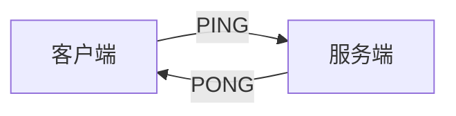

# WebSocket

## 协议简介

WebSocket 是一种通过单个 TCP 连接在客户端和服务器之间建立全双工双向通信通道的协议，它通过 HTTP 工作，使用端口 80 和 443，并允许重复使用现有的防火墙规则。

WebSocket 的连接首先要发起一个 HTTP 的请求，该请求中包含一个名为 `Upgrade` 的请求头，值为 `websocket`，表示当前请求需要升级到 WebSocket 协议，**这一步我们称为 WebSocket 的握手**。

以下示例显示了这样的交互：

```yaml
GET /spring-websocket-portfolio/portfolio HTTP/1.1
Host: localhost:8080
Upgrade: websocket 
Connection: Upgrade 
Sec-WebSocket-Key: Uc9l9TMkWGbHFD2qnFHltg==
Sec-WebSocket-Version: 13
Origin: http://localhost:8080
```

握手成功时，响应的状态码并不是 200，而是 101，表示升级协议成功，响应示例如下：

```yaml
HTTP/1.1 101 Switching Protocols 
Upgrade: websocket
Connection: Upgrade
Sec-WebSocket-Accept: 1qVdfYHU9hPOl4JYYNXF623Gzn0=
```

握手成功后，HTTP 升级请求底层的 TCP 套接字保持打开状态，供客户端和服务器继续发送和接收消息。

> 请注意，如果 WebSocket 服务器在 Web 服务器（例如 nginx）后面运行，您可能需要将其配置为将 WebSocket 升级请求传递到 WebSocket 服务器。同样，如果应用程序在云环境中运行，请查看云提供商有关 WebSocket 支持的说明。


关于 WebSocket 的更多详情可以[RFC 6455](https://tools.ietf.org/html/rfc6455)，或者其他网上的相关文档，这里不做深入展开。


## 快速安装

BallCat 基于 [Spring WebSocket](https://docs.spring.io/spring-framework/docs/current/reference/html/web.html#websocket) ，对 WebSocket 的使用进行了二次封装，提供了更便捷的使用形式。

### 依赖引入

springboot 项目，直接在项目中引入 starter 组件：

```xml-vue
<dependency>
  <groupId>org.ballcat</groupId>
  <artifactId>ballcat-spring-boot-starter-websocket</artifactId>
  <version>{{ $frontmatter.ballcatVersion }}</version>
</dependency>
```

非 spring-boot 项目，则在引入以上依赖后自己手动对依赖包中的配置类进行注册处理。

### 业务组件

**如果没有使用基于 ballcat 搭建的后台管理系统，则不需要添加此依赖**！

```xml-vue
<dependency>
  <groupId>org.ballcat</groupId>
  <artifactId>ballcat-admin-websocket</artifactId>
  <version>{{ $frontmatter.ballcatVersion }}</version>
</dependency>
```

此依赖中自定义了一些 ballcat 后台管理相关的 websocket 使用：

- 自定义了握手拦截器：握手时进行了 token 鉴权
- 自定义了 SessionKeyGenerator: 使用 userId 作为 sessionKey
- 添加了修改字典以及发布关闭公告时对客户端的推送业务逻辑处理

### 配置属性

**ballcat-spring-boot-starter-websocket** 提供了以下的属性配置

| 属性                                          | 描述                                                         | 默认值    |
| --------------------------------------------- | ------------------------------------------------------------ | --------- |
| ballcat.websocket.path                        | websocket 连接的地址                                         | /ws       |
| ballcat.websocket.allow-origins               | 允许websocket客户端访问源，防止跨域，不允许在 allowCredentials=true 的情况下使用 “*” 值，需要使用 allowed-origin-patterns 作为替代 | -         |
| ballcat.websocket.allowed-origin-patterns     | 允许websocket客户端访问源，防止跨域，此属性优先于 `allow-origins` | *         |
| ballcat.websocket.heartbeat                   | 是否注册 PingJsonMessageHandler 自动处理心跳检测             | true      |
| ballcat.websocket.mapSession                  | 是否自动记录和移除 webSocketSession                          | true      |
| ballcat.websocket.messageDistributor          | 消息分发器：local \| redis \| custom                         | local     |
| ballcat.websocket.concurrent.enable           | 是否在多线程环境下进行发送，默认关闭                         | false     |
| ballcat.websocket.concurrent.sendTimeLimit    | 多线程竞争时，发送时间上限（ms）                             | 5000      |
| ballcat.websocket.concurrent.bufferSizeLimit  | 多线程竞争时，发送消息缓冲上限 (byte)                        | 102400    |
| ballcat.websocket.concurrent.overflowStrategy | 消息缓冲溢出时的执行策略                                     | TERMINATE |


yml 配置示例：

```yaml
ballcat:
  websocket:
  	path: '/ws'
  	allow-origins: '*'
  	heartbeat: true
  	mapSession: true
    message-distributor: redis #使用 redis 做为消息分发器
    concurrent: 
      enable: true  # 允许多线程发送
      send-time-limit: 5000
      buffer-size-limit: 102400
      overflow-strategy: terminate
```


## 功能使用

### 连接建立

> 这里可以参看 ballcat-samples 仓库里的 websocket 项目，里面有完整的前后端 websocket 的使用示例。

**ballcat-spring-boot-starter-websocket** 默认提供的 websocket 连接地址为 `ws://server:port/context-path/ws`

- server：域名 或 IP

- port：服务器端口

- context-path：应用程序的上下文路径，springboot 默认为空

- ws: 默认的 websocket 注册的端点路径，可以通过 `ballcat.websocket.path` 配置修改

  

客户端可以使用任何语言编写，javascript、java、node 等都行，我们这里以 javascript 为示例：

```javascript
let webSocketClient = new WebSocket('ws://localhost:8800/ws')
```

这样即完成了一个 websocket 的连接。

### 传参与鉴权

在实际业务系统中，我们不会让所有来源的客户端都可以进行 WebSocket 的连接建立，我们需要对需要进行建立连接的客户端做一个鉴权处理，拦截掉没有权限的客户端。

由于 WebSocket 连接的建立需要先通过 HTTP 进行握手，所以我们可以在握手这一步进行一个鉴权处理，通过客户端携带的请求参数来判断当前连接是否允许建立，例如携带一个 `token`。

在 Websocket 协议的设计中，是无法在请求头中携带参数的，只能通过 QueryString 的方式进行传参。

例如如下的连接中，携带了一个 `token` 参数，值为 `123456`：

```javascript
let webSocketClient = new WebSocket('ws://localhost:8800/ws?token=123456')
```

这样，服务端在 websocket 的握手过程中，通过 **握手拦截器** 即可获得客户端传递的参数 `token`。 

下面是一个服务端的握手拦截器示例（**需注册到 spring 容器中才可生效**）：

```java
@Component
public class MyHandshakInteceptor implements HandshakeInterceptor {

	@Override
	public boolean beforeHandshake(ServerHttpRequest request, ServerHttpResponse response, WebSocketHandler wsHandler,
			Map<String, Object> attributes) throws Exception {
		if (request instanceof ServletServerHttpRequest) {
			ServletServerHttpRequest serverRequest = (ServletServerHttpRequest) request;
			// websocket 连接示例：ws://localhost:8800/ws?token=123456
			String token = serverRequest.getServletRequest().getParameter("token");
            
            // 在这里可以进行鉴权，如果不通过返回 false
            if(token 无效){
                return false;
            }
            
            // 添加到属性中，方便后续获取
            attributes.put("TOKEN", accessToken);
            // 这里可以通过 token 获取到用户的一些基本信息，如 userId，根据自己业务定制逻辑,以下是 ballcat-admin 模块的逻辑：
            // 由于 WebSocket 握手是由 http 升级的，携带 token 已经被 Security 拦截验证了，所以可以直接获取到用户
			SysUser sysUser = SecurityUtils.getSysUser();
            attributes.put("USER_ID", sysUser.getUserId());
		}
		return true;
	}

	@Override
	public void afterHandshake(ServerHttpRequest request, ServerHttpResponse response, WebSocketHandler wsHandler,
			Exception exception) {

	}

}
```


### Session存储

每个客户端和服务端建立的 websocket 连接，在服务端都对应一个会话，即 WebScoketSession 对象，为了方便管理所有的连接，以及做到向指定的连接进行消息推送，我们需要存储已经建立好的 session ，并且给每个 session 分配一个唯一标识。

**ballcat-spring-boot-starter-websocket** 为此抽象了 `WebSocketSessionStore` 接口，并提供了默认的实现，在 websocket 连接建立或者断开时，自动加入或移除对应的 session。

而 session 的唯一标识则是通过 `SessionKeyGenerator` 对象获取的：

```java
public interface SessionKeyGenerator {
	/**
	 * 获取当前session的唯一标识
	 * @param webSocketSession 当前session
	 * @return session唯一标识
	 */
	Object sessionKey(WebSocketSession webSocketSession);
}
```

用户需要自己实现该接口，并注册到 spring 容器中。

> ballcat-admin-websoket 包中提供了此类的实现，使用 userId 作为 session 的唯一标识。

```java
@Component
@RequiredArgsConstructor
public class UserSessionKeyGenerator implements SessionKeyGenerator {

	@Override
	public Object sessionKey(WebSocketSession webSocketSession) {
        // 这里获取从之前的握手拦截器中放入的用户id
        // 这样后续我们在做消息推送的时候就可以方便的通过 userId 找到连接的客户端了
		return webSocketSession.getAttributes().get("USER_ID");
	}

}
```


### 心跳处理

由于 TCP 连接的机制问题，建立长连接的双方可能在连接断开的时候无法及时的感知到，为了保证在连接断开失效后可以及早的发现并进行重连，一般会由建立长连接的某一方进行定时进行数据包的发送，以此探测连接是否异常。（在使用 nginx 做反向代理时，由于 nginx 默认会在一段时间后断开没有发生数据交互的连接，这时通过定时心跳就可以进行保活）


**ballcat-spring-boot-starter-websocket** 默认注册了一个 Pong 消息处理器，在收到客户端的 Ping 消息后会自动响应 Pong 消息，完成一个心跳链路：



Ping 消息结构如下：

```json
{"type": "ping"}
```

Pong 消息结构如下：

```json
{"type": "pong"}
```

客户端消息发送：

```javascript
webSocketClient.send({"type": "ping"})
```


我们可以在客户端设置一个定时处理，每 30s 发起一次 Ping 消息发送。


用户可以自定义自己的心跳处理，比如通过设置 `ballcat.websocket.heartbeat=false` 可以取消默认的对 Ping 消息的处理机制，设置定时任务，让服务端定时向客户端发送心跳的，进行主动探测。


### 消息格式

WebSocket 实际对于消息的格式并没有做规定，使用者可以自定义自己的消息格式，或者使用一些标准的二级协议，如 **STOMP**。


**BallCat WebSocket 自定义了一套消息的格式标准:**

- 要求消息内容必须是一个 **Json** 对象
- **Json** 对象中必须有一个属性 `type`

例如上面心跳中的 Ping 消息和 Pong 消息：

```json
{"type": "ping"} // ping
{"type": "pong"} // pong
```


在服务端的代码中，这些 WebSocket 的消息的对应类，都推荐继承 `JsonWebSocketMessage` 抽象类，以保证其拥有的 `type` 属性。

```java
public abstract class JsonWebSocketMessage {

	public static final String TYPE_FIELD = "type";

	private final String type;

	protected JsonWebSocketMessage(String type) {
		this.type = type;
	}

	public String getType() {
		return type;
	}

}
```

例如 Ping 消息，在 Java 代码中的表示如下，标识其 type 值为 "ping"：

```java
public class PingJsonWebSocketMessage extends JsonWebSocketMessage {
	public PingJsonWebSocketMessage() {
		super("ping");
	}
}
```


### 消息接收

当前端传递过来的消息体符合 BallCat 的消息体格式时，我们可以通过注册对应类型的 `JsonMessageHandler` 消息处理器来消费这些消息，Ballcat 会自动根据消息体中的 type 进行消息路由，分发到对应的消息处理器中处理，例如我们在心跳处理时，客户端发送 Ping 消息时，服务端会自动回复一个 Pong 消息，就是因为默认服务注册了一个 `PingJsonMessageHandler` 来处理这个逻辑。


**下面我们来完成一个实例：**

1. **消息结构定义**
  
    首先自定义一种类型为 `say-hello` 的消息，当发送该类型的消息到服务端时，
    
    ```json
    {
        "type": "say-hello", // 当前消息体的类型
        "languge": "中文"  // json 体中的可以添加额外的属性，这个属性用来表示返回的语言类型
    }
    ```
    
    服务端自动回复一种类型为 `hello` 的消息，并根据指定的语言回复一个 "Hello" 或者 "你好"：
    
    ```json
    {
        "type": "hello", // 当前消息体的类型
        "text": "你好"  // 中文时返回你好，其他时候都是 Hello
    }
    ```


2. **新建消息体类型**

   ```java
   public class SayHelloJsonWebsocketMessage extends JsonWebSocketMessage {
   	/**
   	 * 回复的语言，默认英文
   	 */
   	private String language;
   
   	public SayHelloJsonWebsocketMessage() {
   		super("say-hello");
   	}
   
   	public String getLanguage() {
   		return language;
   	}
   
   	public void setLanguage(String language) {
   		this.language = language;
   	}
   }
   ```

   ```java
   public class HelloJsonWebsocketMessage extends JsonWebSocketMessage {
   
   	private String text;
   
   	public HelloJsonWebsocketMessage() {
   		super("hello");
   	}
   
   	public String getText() {
   		return text;
   	}
   
   	public void setText(String text) {
   		this.text = text;
   	}
   }
   ```

3. **新建一个 `say-hello` 类型的消息处理器，并注册到 Spring 容器中：**

   ```java
   @Component
   public class SayHelloJsonWebSocketMessageHandler implements JsonMessageHandler<SayHelloJsonWebsocketMessage> {
   
   	@Override
   	public void handle(WebSocketSession session, SayHelloJsonWebsocketMessage message) {
   		String language = message.getLanguage();
   		HelloJsonWebsocketMessage helloJsonWebsocketMessage = new HelloJsonWebsocketMessage();
   		if ("中文".equals(language)) {
   			helloJsonWebsocketMessage.setText("你好");
   		}
   		else {
   			helloJsonWebsocketMessage.setText("Hello");
   		}
   		WebSocketMessageSender.send(session, helloJsonWebsocketMessage);
   	}
   
   	@Override
   	public String type() {
           // 注意，这里的返回值要和 SayHelloJsonWebsocketMessage 的 type 一致。
   		return "say-hello";
   	}
   
   	@Override
   	public Class<SayHelloJsonWebsocketMessage> getMessageClass() {
   		return SayHelloJsonWebsocketMessage.class;
   	}
   
   }
   ```

4. **前端进行消息发送**

    ```javascript
    webSocketClient.send({
        "type": "say-hello", 
        "languge": "中文"
    })
    ```

    这时，在控制台中即可看到服务端的响应信息了。

> 注意：这里仅仅是一个演示，收到消息并不是一定需要回复，实际业务可以在 handle 方法中，进行其他的业务处理，如数据修改落库等


**如果发送的消息不是 Json 类型，或者不符合我们的格式要求，会默认回退使用 `PlanTextMessageHandler` 类型的消息处理器**，用户可以自定义类，实现 `PlanTextMessageHandler` 接口，并将其注册到 Spring 容器中，然后在其 handle 方法中处理自己的逻辑。


### 消息推送

虽然消息体只需要是 String 类型即可，但还是推荐使用 ballcat 定义的[消息格式](#消息格式)，使用时通过对应实体转换到 json 字符串：

```java
HelloJsonWebsocketMessage helloJsonWebsocketMessage = new HelloJsonWebsocketMessage();
helloJsonWebsocketMessage.setText("Hello");
// 消息内容
String messageText = JsonUtils.toStr(helloJsonWebsocketMessage)
```

#### 消息分发器

消息发送推荐使用消息分发器 `MessageDistributor`，方便在集群环境下时做到跨服务的消息推送，详细在[WebSocket 集群](#Websocket 集群)一节会有介绍，`MessageDistributor` 对象已经默认注册到 spring 容器中, 使用时直接依赖注入即可拿到。

如果已经拿到了 session，比如在[消息接收](#消息接收)一节中，我们是对当前 session 做回复处理，就可以直接通过 `WebSocketMessageSender` 做消息推送：

```java
WebSocketMessageSender.send(session, helloJsonWebsocketMessage);
```

#### 消息广播

消息广播会对所有的连接上系统的客户端进行消息推送

```java
// 组装消息
MessageDO messageDO = new MessageDO()
    .setNeedBroadcast(true) // 广播
    .setMessageText(messageText); // 消息内容 

// 分发
messageDistributor.distribute(messageDO);
```

#### 指定客户端推送

```java
// 之前的 SessionKeyGenerator 中我们设置了 wsSession 的 sessionKey 为用户id
// 所以这里只需要获取到需要被推送的 userIds 即可
List<Object> sessionKeys = pushUserIds;

// 组装消息
MessageDO messageDO = new MessageDO()
    .setSessionKeys(sessionKeys) // 向指定的用户id 发送
	.setMessageText(messageText); // 消息内容 

// 分发
messageDistributor.distribute(messageDO);
```

### 并发消息推送

**如果同时对同一个 WebSocketSession 进行消息推送，就会产生并发问题，抛出连接关闭的异常**

需要将 `ballcat.websocket.concurrent.enable` 配置修改为 true


## WebSocket 集群

当服务端使用集群模式部署时，会导致服务间无法感知各自建立的 websocket 连接信息，当进行广播，或者进行指定用户发送时，就会出现问题。

比如，当前使用 A,B 两台服务器进行部署，用户 zhangsan 的 websocket 连接被路由到 A 服务器，这时一个针对 zhangsan 的消息发送逻辑被分发到 B 服务器进行处理，由于 B 服务器并未和 zhangsan 建立 websocket 连接，就会导致消息发送失败。

为了解决这个问题，`ballcat` 中 抽象出了 `MessageDistributor` 消息分发器，并提供了 `RedisMessageDistributor` 类（注意：默认注册的是 `LocalMessageDistributor`，如需使用 redis 需要通过配置进行修改）。

当需要进行 websocket 消息发送时，不再直接调用 `WebSocketMessageSender` 发送信息，而是利用 Redis，进行了一个订阅消息的发布，各个节点接收到此订阅消息时，再去执行消息发送，这样不管用户的 websocket 连接，和哪个节点建立的，都不会受到影响。

如果用户不使用集群模式部署，则无需处理，使用默认注册的 `LocalMessageDistributor` 即可。

> redis 的订阅模式无持久化，如用户有更高要求，可以自定义分发器，例如使用消息队列进行消息的分发处理。


## 前端使用示例

前端组件 `GlobalWebSocket.vue` 中已经自动进行了 websocket 的连接和心跳处理等逻辑。


当前端接收到服务单推送的 websocket 消息时，会自动的向 Vue 的事件总线 `EventBus` 中发布一个事件。

```js
onMessage (msgEvent) {
  //收到服务器信息，心跳重置并发送
  this.startHeartbeat()
  let event;
  let data;
  const text = msgEvent.data
  try {
    data = JSON.parse(text)
    event = data.type
    // 心跳响应跳过发布
    if(event === 'pong'){
      return
    }
  }catch (e) {
    // 纯文本消息
    event = 'plaintext'
    data = text
  }
  this.$bus.$emit(event, data);
},
```

如上代码所示，当接收到的消息为 json 时，将会发布一个类型为 jsonMessageType 的事件，而消息非 json 时，将会发布一个类型为 'plantext' 的事件。用户只需要注册对应的事件处理器，用于处理事件即可。


事件处理器的注册，可以参考 `GlobalWebSocketListener` 组件，其默认注册了 dict-change 和 lov_change 的事件处理器。

