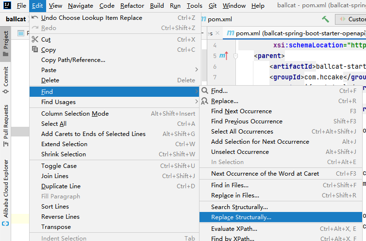
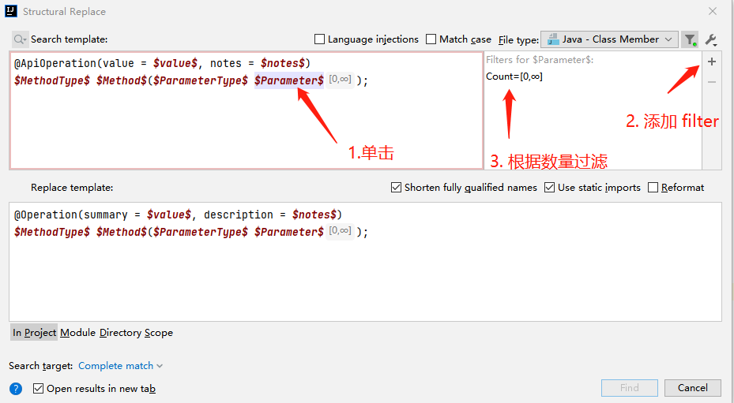
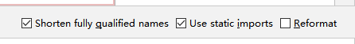
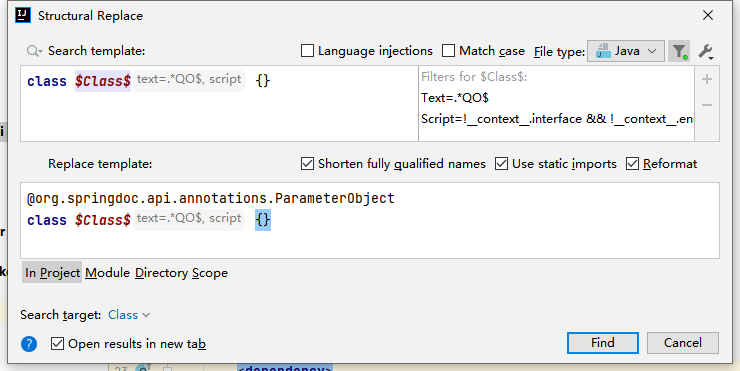

# Swagger2.x  升级 OpenApi3.x 不完全指南

OpenApi 3 其实就是 Swagger2 的升级版。

swagger 在捐献给 Linux 基金会后，就更名为 **OpenAPI Spec (OAS)**

并在 2017 年的时候发布了新的 `OpenApi 3.0` 规范。

此文档用于将 java 应用程序从 swagger2.x 迁移到 openApi3 规范支持。


## 1. 升级 swagger 相关依赖

原依赖：

```xml
		<dependency>
			<groupId>io.swagger</groupId>
			<artifactId>swagger-annotations</artifactId>
		</dependency>
		<dependency>
			<groupId>io.swagger</groupId>
			<artifactId>swagger-models</artifactId>
		</dependency>
```

替换为：

```xml
		<dependency>
			<groupId>io.swagger.core.v3</groupId>
			<artifactId>swagger-annotations</artifactId>
		</dependency>
		<dependency>
			<groupId>io.swagger.core.v3</groupId>
			<artifactId>swagger-models</artifactId>
		</dependency>
```


>  openApi 相关注释或者实体的的包，均是以 `io.swagger.v3.oas` 开头的，注意不要引用错误。


## 2. 注解替换

**注意：这里只列了一些最基本的注解和属性，实际替换需求，请根据自己项目使用情况调整**


### 2.1 替换 @ApiOperation => @Operation

- Idea 全局替换包引入（windows 快捷键 `Ctrl + Shift + R`）:

    ```java
    import io.swagger.annotations.ApiOperation;
    ```
    
    ```java
    import io.swagger.v3.oas.annotations.Operation;
    ```


- idea 结构替换：

    **由于结构替换后，注解的属性将不会保留其他的，所以要先替换同时拥有 value 和 notes 属性的注解，再替换有 value 属性的注解。如果你的项目中，`@ApiOperation `  注解中拥有更多的属性，请自己按这个逻辑梳理替换顺序。**
    
    结构替换：edit => find => replace structurally
    
    
    
    
    
    再弹窗框中，输入你的搜索模板，以及替换模板，并对模板的条件设置一些规则：
    
    search template:
    
    ```java
    @ApiOperation(value = $value$, notes = $notes$)
    $MethodType$ $Method$($ParameterType$ $Parameter$);
    ```
    
    replace template:
    
    ```java
    @Operation(summary = $value$, description = $notes$)
    $MethodType$ $Method$($ParameterType$ $Parameter$);
    ```
    
    
    
    
    **这里的 $Parameter$ 添加 filter，count => [0, 无穷大]，表示匹配任意数量入参的方法**
    
    
    
    
    
    注意，这两个选项需要勾选，表示使用短的全类名，和使用静态 import 包。
    
    如果不勾选的话，替换完后注解将会变成，`@io.swagger.v3.oas.annotations.Operation` 的全类名形式。
    
    


- 替换完成后，继续替换只有 value 属性的 `@ApiOperation`：


    ```java
    @ApiOperation(value = $value$)
    $MethodType$ $Method$($ParameterType$ $Parameter$);
    ```
    
    ```java
    @Operation(summary = $value$)
    $MethodType$ $Method$($ParameterType$ $Parameter$);
    ```


### 2.2 替换 @Api => @Tag

- Idea 全局替换包引入：

    ```java
    import io.swagger.annotations.Api;
    ```
    
    ```java
    import io.swagger.v3.oas.annotations.tags.Tag;
    ```


- Idea 结构替换：

    >  注意这里，替换后，将只剩下 name 属性，如果你的项目中 @Api 注解上使用了更多的属性，请参考 2.1 节的方法，以由多到少的顺序逐个替换
    
    ```java
    @Api(tags= $tag$)
    class $Class$ {}
    ```
    
    ```java
    @Tag(name = $tag$)
    class $Class$ {}
    ```


### 2.3 替换 @ApiModel => @Schema

- Idea 全局替换包引入

    ```java
    // 原包名
    import io.swagger.annotations.ApiModel;	
    // 替换为
    import io.swagger.v3.oas.annotations.media.Schema;
    ```
    
    ```java
    // 原包名
    import io.swagger.annotations.ApiModelProperty;
    // 替换为，这里可能会有导包重复，格式化全局处理下就好
    import io.swagger.v3.oas.annotations.media.Schema;
    ```


- Idea 结构替换

    ```java
    @ApiModel(value = $value$)
    class $Class$ {}
    ```
    
    ```java
    @Schema(title = $value$)
    class $Class$ {}
    ```
    
    
    
    ```java
    @ApiModelProperty(value = $value$)
    $FieldType$ $Field$ = $Init$;
    ```
    
    ```java
    @Schema(title = $value$)
    $FieldType$ $Field$ = $Init$;
    ```


### 给 QO 添加 @ParameterObject 注解

ballcat 中，分页查询的参数均封装在以 QO 结尾的对象中，`@ParameterObject` 注解，用于扁平化 `GetMapping` 中的入参，否则 swagger-ui 中显示的会是 json 形式参数。



```java
class $Class$ {}
```

```java
@org.springdoc.api.annotations.ParameterObject
class $Class$ {}
```

filter 规则如下：
```java
Text = .*QO$
Script = !__context__.interface && !__context__.enum && !__context__.record
```


## 3. 更多替换

上面并没有列出所有的注解替换规则，且由于官方 wiki 一直没有更新，暂时只能参看 springdoc 的文档：https://springdoc.org/#migrating-from-springfox ，了解注解替换规则。

也欢迎大家在替换过程中发现一些问题或者注意的点，来提交 PR，完善此文档。


用 swagger 3 注释替换 swagger 2 注释（它已经包含在`springdoc-openapi-ui`依赖项中）。swagger 3 注释的包是`io.swagger.v3.oas.annotations`.

- `@Api` → `@Tag`
- `@ApiIgnore`→`@Parameter(hidden = true)`或`@Operation(hidden = true)`或`@Hidden`
- `@ApiImplicitParam` → `@Parameter`
- `@ApiImplicitParams` → `@Parameters`
- `@ApiModel` → `@Schema`
- `@ApiModelProperty(hidden = true)` → `@Schema(accessMode = READ_ONLY)`
- `@ApiModelProperty` → `@Schema`
- `@ApiOperation(value = "foo", notes = "bar")` → `@Operation(summary = "foo", description = "bar")`
- `@ApiParam` → `@Parameter`
- `@ApiResponse(code = 404, message = "foo")` → `@ApiResponse(responseCode = "404", description = "foo")`

